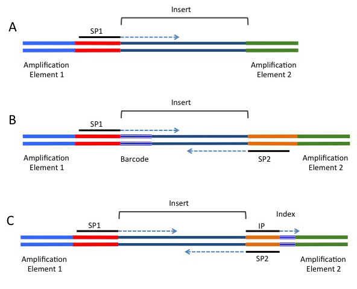
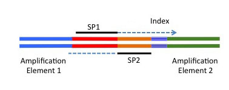
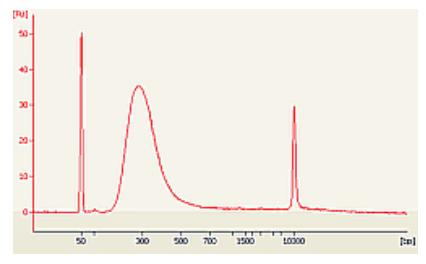
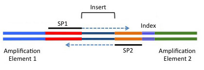
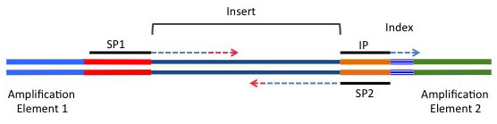
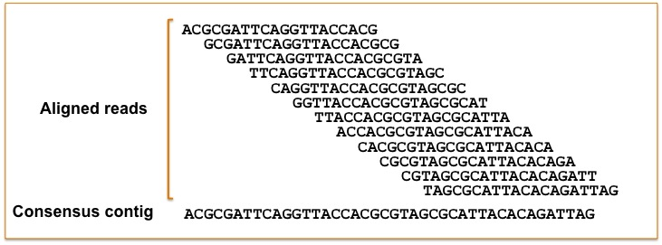
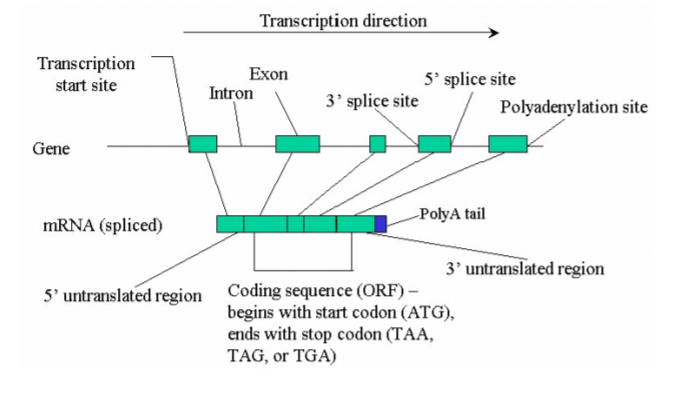
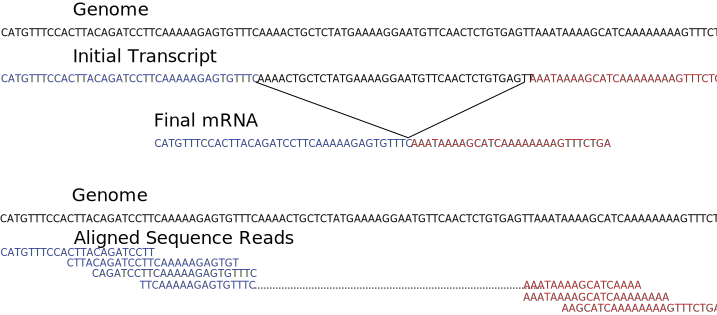
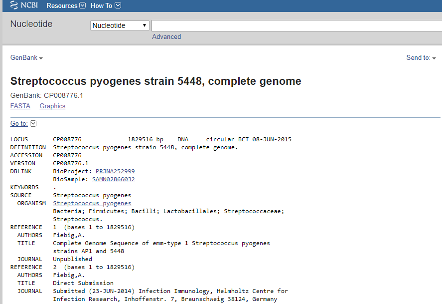

\**Note: This assignment has several associated questions you'll find as you go through this that need to be submitted on ELMS. Some of these ask you to explain or guess why certain things may be the way that they are. I am not grading on correctness here, rather I am grading based on whether you have completed the assignment and put some thought into the answers. Feel free to discuss these with your group, peer mentors, or with me in lab. We will likely go over some of the more important material during class as well.*

**Q1) Please collect each successful command you run and submit these as answer 1. Specifically, submit the list of complete commands another student would need to run to precisely replicate the analysis you performed.**

# Submission

This assignment will be linked on ELMS and there should be a submission form for ASN1-3. You should submit this assignment individually. Feel free to work with and discuss the process and questions with classmates, but make please write your own answers!

# 2-i. Trimming our RNA-Seq reads

## What needs to be "trimmed" off?

In the last assignment we took a look at the sequence files we get as the result of RNA sequencing. We saw that you get a series of sequence fragments in the form of a FASTQ file:

```
@READ1 NAME AND DETAILS
GCGATTAGCGACGATCGGAGCAGGCAGCGAGCTATACGATG
+READ1 NAME AND DETAILS
IIIIIIIIIIIIIIIIIIIIIIIIIIIIII9IG9ICIIA95
```

The second line is the most important, the DNA sequence the sequencer machine read for this particular fragment of nucleic acid. If everything went to plan, we believe this is a random sample of a fragment of DNA made randomly from the pool of RNA we got out of our cells. The reality is that not every read was performed correctly. To understand what went wrong, let's take a look at what the DNA fragments we actually put into the sequencer machine look like:



Unfortunately, no current technology allows us to simply determine the exact and complete sequence of a physical piece of DNA. Every currently existing method needs some sort of "handle" a predictable piece of DNA external to the sequence from which to begin the sequencing process. Molecular biology techniques performed in a lab or in specialized equipment add additional pieces of DNA to each end of our sequence fragments. In the above schematic, the piece of DNA we want sequenced is labeled the "Insert". This is a piece of cDNA we generated from our RNA. We generally construct these fragments so that these "inserts" are 150-600 bases long.

The schematic shows three variants, or ways which we can construct DNA fragments for sequencing, although there are certainly others, these are the most common. The first, most minimal way, involves adding that sequencing handle, labeled "SP1" or "sequencing primer 1" to one end. The sequencer will use this handle and begin generating sequence from the very next DNA base, the first base of the Insert (shown by the dotted blue line). These methods also add a second set of handles to either side, to allow us to generate more copies of this DNA, either with the process of PCR, or the process of cluster generation we briefly covered earlier. 

More complicated protocols may add a second sequencing primer site to the other side of the insert. This lets the machine perform a second step to obtain the sequence of the other end of our "Insert" DNA. Additionally, "Barcodes" may be added, these are special sequence fragments which we can associate with specific samples to allow us to mix together or "multiplex" many samples in a single run, while being able to determine from which sample each DNA fragment originated. Our samples, as well as most standard libraries, most closely resemble the third option, C.



There are several ways in which the read generated from SP1 or SP2 might not be exactly the insert we hope to see. Imagine a situation in which there is no insert at all, and instead the SP1 and SP2 are fused directly to each other. This is a real, and perhaps not uncommon, phenomenon known as "primer-dimer". In this case, this DNA fragment will likely still function in the sequencing machine, but instead of giving us a sequence of an RNA fragment, this will return the DNA sequence of the "handles" themselves, the primer sequences we used to make this special sequencing fragment. Since these are not from our genome, they aren't biologically relevant. If programs are expecting our sequence reads to have come from the genome, they will be very confused about where this arbitrary sequence came from!

Another potential issue concerns the length of our DNA insert. We have not yet mastered nanotechnology to the degree that we can generate completely uniform random fragments of DNA, our best techniques will generate a *distribution* of fragment sizes. We might attempt to generate 300 bp fragments of DNA. If our process works well, we might generate fragments with a size distribution that looks something like this:



With a distribution like this, if we choose to sequence 100 bp from each side of these fragments, most of the time we will get two distinct sequences from either side, and the reads will look like they do in option C above. With shorter fragments, the ends of each read may overlap a bit. This is not necessarily a problem, and in many cases is even desirable. What happens when we have a *very* short insert? 



If the length of the insert itself is shorter than our reads, the 3' end our of sequence read won't contain our insert, instead it will contain part of our handles, our sequencing primer! In this case, instead of the entire sequence being non-biological, only part of this will. In some ways, this may be even more confusing to the algorithms than a completely artificial sequence!



The final issue we'll discuss here concerns the *quality* of our reads. Because sequencing is a very technical process that happens step-by-step, sometimes specific steps experience issues, and the quality of the results in that particular section may go down. This happens most often at the end of the run, at the 3' end of our sequences. For example, the last bit of each read could have experienced issues. If this happens, we may get semi-random sequence at the end of our read, or even "N" characters where the sequencer was completely unable to guess what base might have been present. Similarly, since these sequences won't resemble the part of the genome that "should" be at that part of the read, this complicates the process of determining where that read originated.

Because having non-biological sequences in our data might confuse our programs or interfere with accurate quantification, we want to be able to detect and fix these issues. Our particular datasets are quite clean and have very minimal primer contamination, so we probably did not detect any last week with FastQC, but some of the outputs you may have noticed in the FastQC output were "Overrepresented Sequences" or "Adapter Content". We probably only observed a very tiny amount of adapter contamination, if any. We may still want to apply our filtering and trimming, just to be safe.

To fix these issues, we can do a few things. In the first case, where our reads are entirely artificial, we would like to simply remove them. In the second case, our reads still have valuable information we don't want to throw away, so we would like to keep what is useful, and remove what is harmful. We can do this through a process of read trimming. There are a variety of tools that can solve all of these problems: CutAdapt, Trimmomatic, Flexbar, and Prinseq, just to name a few. 

**Q2) How should each sequence read in our read pairs relate to each other, given the design in part C above? If our two reads overlap, will they contain identical text in our FASTQ files? Why or why not? Remember, we always write down DNA sequences in the 5' -> 3' direction.**
 
## Quality trimming with Flexbar
 
Much like the standard Unix programs we utilized last week to view and analyze some of our sequence files, Flexbar is a command-line tool that works the same way.

- https://github.com/seqan/flexbar
 
`#flexbar --reads [reads1.fastq.gz] --reads2 [reads2.fastq.gz] --target [output_prefix] -a [adapters] [other options]`

First, we should keep things tidy and work in a specific folder for this assignment:

```bash

cd ~
mkdir ASN3
cd ASN3

```

Since libraries can be constructed in many ways, with many sequencing primer sequences, we need to tell Flexbar which sequences to look for. A file containing these sequences is helpfully available online. We will download this so we can give these sequences to Flexbar:

```bash
wget http://genomedata.org/rnaseq-tutorial/illumina_multiplex.fa
```

Finally, we will trim one of our datasets! Because our datasets are very large, trimming one set might take 45 minutes, and none of us want that at this moment. First, we will make a reduced copy of our dataset with only two million sequence reads. We will do all of the following commands for two datasets, `SRR2155075` and `SRR2155078` Fortunately, since we are only using the first two million reads, it doesn't matter how long the dataset was to begin with!

```bash

gzip -dc /mnt/storage/data/leishmania/[SRA Accession]_1.fastq.gz | head -n 4000000 | pv -l | gzip -c > [SRA Accession]_1.2m.fastq.gz
gzip -dc /mnt/storage/data/leishmania/[SRA Accession]_2.fastq.gz | head -n 4000000 | pv -l | gzip -c > [SRA Accession]_2.2m.fastq.gz

```

With this pipeline, we are able to: 

1. Start decompressing one of the datasets.
2. Send those uncompressed sequence reads to the `head` command and take the first 4,000,000 lines (4 lines per sequence read)  
3. send those through an intermediate program `pv` "pipe viewer" which will show us a progress bar of lines completed. We use the `-l` option to show "l"ines instead of bytes. `pv` simply inputs and outputs the same data while showing a progress bar.
4. Send those back to the `gzip` command, this time without the `-d` flag, so it will compress instead of decompress.
5. finally use the `>` symbol to send the output into a new file in our current directory. We want to run this twice, once for each of the two pairs of sequence reads for that dataset.

Now, we are prepared to start trimming this reduced dataset.

```bash
flexbar --adapter-min-overlap 7 --adapter-trim-end RIGHT --adapters illumina_multiplex.fa --max-uncalled 5 --min-read-length 25 --threads 4 --zip-output GZ --reads [SRA Accession]_1.2m.fastq.gz --reads2 [SRA Accession]_2.2m.fastq.gz --target [SRA Accession]_trim
```

There is a lot going on in this command, so we'll break it down:

- `flexbar` This is the program we are running.
- `--adapter-min-overlap 7` This option tells flexbar to only trim sequences if it finds at least seven bases. Since there are only four possible bases, you might expect to find 1-6 of them pretty commonly, just by chance.
- `--adapter-trim-end RIGHT` This option tells flexbar to only look for adapter sequences on the right, 3', side. This matches up with our understanding of where the contaminating sequence is likely to be for our particular data. Other types of sequencing might expect primers on the left, or 5' side.
- `--adapters illumina_multiplex.fa` This provides the sequences of the adapters for flexbar to look for.
- `--max-uncalled 5` In addition to looking for primers, flexbar can also look for low-quality or "uncalled" bases, positions where an N is present. Our other programs can handle a small number of these, but too many will interfere, so we will remove sequences that contain more than five of these "uncalled" bases.
- `--min-read-length 25` Although we are starting with ~100 bp sequences, in some cases we may trim off a lot of sequence. In order to be useful, we need enough sequence to unambiguously determine which part of the genome the sequence came from. In general, about 25 bases is necessary for this, so we remove any sequences shorter than this after trimming.
- `--threads 4` This tells the program how many reads to analyze at once. Since our computer can process up to 16 threads at a time, this could go faster, but since we are all sharing the same computer we don't want to stress things by having multiple people try to max it out all at once.
- `--zip-output GZ` Since these are big files and we are all making a copy, this option tells flexbar to compress the output to save space.
- `--reads [SRA Accession]_1.1m.fastq.gz` These two options tell flexbar where to find our sequence reads.
- `--reads2 [SRA Accession]_2.1m.fastq.gz` 
- `--target [SRA Accession]_trim` Since flexbar needs to output a separate file for read 1 and read 2, it can't simply send the output out like `grep` or `gzip`. This option tells the program where to save the output. In this case, this tells it to save the files in the current directory in files with names starting with, for example: `SRR1346050_trim`

This command will probably take a minute or two to run. *Remember to do this for both of the SRA accessions we are analyzing.* Flexbar generates the output, which should be a trimmed version of our input data: similar, probably a little smaller. We can take a look at both the input and output files:

```bash

ls -lh [SRA Accession]_*.fastq.gz
gzip -dc [SRA Accession]_1.2m.fastq.gz | wc
#zcat [SRA Accession]_1.2m.fastq.gz | wc
gzip -dc [SRA Accession]_trim_1.fastq.gz | wc

```

\*You can also use the `zcat` command instead of `gzip -dc`. This is analogous to the normal `cat` command, except it expects the file to be gzip-compressed and automatically decompresses the file before outputting. 

**Q3) What differences do you notice between the FASTQ files you initially created and the trimmed versions output by Flexbar?**


# 2-ii. Aligning our RNA-Seq reads

It is finally time to put our dataset together with the human genomes we downloaded! Remember, the idea behind this RNA-seq process is to measure how much of each transcript, each RNA is present in our sample cells. The sequencing process generates DNA reads in numbers proportional to the amount of each RNA that they were derived from. Now that we have millions of these fragments, we want to figure out which part of the genome, which possible RNA transcripts these derived from. If we count up how many DNA fragments came from each possible RNA, we'll have a measure of how many RNA there were physically there in the first place!

To find out exactly where in the genome a piece of DNA came from, we need to compare this to the genome, and find a position in the genome with the same (or very similar) sequence to the DNA read itself. We could hypothetically compare each read to every position in the genome. There are approximately 3 billion bases in the human genome. Each of our reads is 100 bases long, so to check if one read is the same as one position we need to compare 100 letters. Since our samples have approximately 100 million reads, we would need to do 3 billion \* 100 million \* 100 comparisons. Even if we have a computer that can perform 40 billion comparisons per second, which is pretty reasonable in this case, it would take over 200 years to check one sample this way. Even this underestimates how long this process might take, because we would like to take into account possible sequencing mistakes.

## Alignment

Fortunately, some very smart computer scientists have come up with algorithms that let us match reads to positions in the genome, lining up a read with its genomic match in a process called "alignment". These operate dramatically faster than the straightforward comparison of every read with every possible position. 




You can visualize this process. Each of our reads (one of the red lines) is a short fragment. This sequence read should have the same sequence as a chunk of our genome, probably a part corresponding to a gene or transcript (blue regions). We have a big pool of reads, and by finding their matching position in the genome we know that we had some fraction of our RNA transcribed from that position. Sometimes the reads don't match perfectly in sequence to the genome. This can be because of errors, or because the genome of the organism we sequenced (maybe my macrophages!) don't have exactly the same sequence as the reference genome, generated from a variety of humans that weren't me. As long as the differences are small (like a single base difference represented by the star and green dots), the aligner will just note the mismatch but align the read to the correct position.

In higher organisms, RNA transcripts are frequently not identical to the underlying genomic sequence because of a process called "splicing".



Eukaryotic organisms construct their final mRNA transcripts by initially transcribing a much longer intermediate transcript and essentially cut-and-pasting individual chunks of RNA sequence together into the final form. If we sequence one of these mature mRNA sequences and the sequence happens to cross this "splice point", the sequence won't match up to the genome anymore. The first part of the read may align to one section of the genome and the second part may align thousands of nucleotides away! For this reason, aligning these types of potentially spliced reads is a substantially harder computational problem and uses different, more advanced alignment software.



The aligner will perform this matching process for every read and output the information about the match to a text file. We'll explore what these "alignment files" look like.

## Aligning reads with Hisat2

Our aligner of choice will be Hisat2. This is a fast aligner that handles transcript splicing accurately and efficiently. Much like flexbar, this is another command-line tool.

- https://ccb.jhu.edu/software/hisat2/manual.shtml

`#hisat2 [options]* -x <ht2-idx> {-1 <m1> -2 <m2> | -U <r>} [-S <sam>]`

Similarly to Flexbar, Hisat2 will need a few files. Obviously this will need our sequence reads, so we will use our trimmed reads. The other core item it needs is a copy of the genome to align to. We could give it the raw FASTA sequence we looked at in ASN2. However, part of the advancements in sequence alignment require special transformations of the reference genome. Additionally, Hisat2 includes special features for handling splicing. Since human mRNAs are made by cut-and-pasting (splicing) together different coding sequences that are not continuous in our genome, Hisat2 can use the GTF annotation we saw in ASN2 to help predict where these splicing events may happen.

The process of generating the special reference genome index files can be very slow, so the authors of Hisat2 provide pre-generated files for us. Since the index is very large, these are already downloaded to the server the same way the datasets were and are are `/mnt/storage/data/GRCh38/`.

```bash

hisat2 -p 4 -x /mnt/storage/data/GRCh38/grch38_tran/genome_tran -1 [SRA Accession]_trim_1.fastq.gz -2 [SRA Accession]_trim_2.fastq.gz | pv -l >  [SRA Accession].sam

```

Hisat2 has many options, but our use-case is pretty standard, so we can utilize only the bare-minimum of options. 

- `hisat2` run the installed copy of the Hisat2 aligner
- `-p 4` run with four parallel threads to speed things up
- `-x /mnt/storage/data/GRCh38/grch38_tran/genome_tran` -x tells Hisat2 where to find the inde"x" containing the information about how to align to the human reference genome in particular
- `-1 [SRA Accession]_trim_1.fastq.gz` These flags tell Hisat2 where to find out sequence reads, and implicitly that they are read1 and read2 pairs
- `-2 [SRA Accession]_trim_2.fastq.gz`
- `| pv -l` Since Hisat2 outputs each read as a line in a format called "SAM" (Sequence Alignment/Map format), we can pipe this through our pipe viewer to track progress
- `> [SRA Accession].sam` Finally, we use the `>` redirection symbol to save this final output to a file with the name of our sample and the `.sam` file extension, appropriate for the type of data we are generating.

This will output some summary detail about how the alignment process went: how many reads aligned or didn't align, whether paired reads aligned "concordantly" (in this case, aligned nearby in the directions they would be expected to from the way our library was designed as in the first section of this assignment), and how different combinations of these behaved. *Remember to do this for both of the SRA accessions we are analyzing.*

**Q4) Compare the summary output of sample SRR2155075 to SRR2155078. What major differences can you see between these two? Why are these different? For some hints, check these two samples in the BioSample/SRA database and remember that we are aligning these sequence reads to the Human genome.**

The design of the SAM format is available in detail at https://samtools.github.io/hts-specs/SAMv1.pdf These files consist of two sections, header lines at the beginning starting with `@` containing information about how the alignment was performed in general, for instance which aligner or genome were used. The remainder of the file is the alignment section. Let's take a look at this SAM file now:

```bash

head -n 30 [SRA Accession].sam

```

These first lines all start with `@`, meaning they are header lines with information about our alignment or genome. In this first section, we see that, except for the first line, all lines start with `@SQ`. The next 20+ lines look similar and have two extra parts, one `SN:` and one `LN:`.

**Q5) Look carefully at the information in these first lines. What do you think the first part represents? What about the second? You can look up what these reference in the SAM description or think back to our exploration of the reference genome in ASN2.**

Next, view the SAM file with the `less` program. Scroll down (with the arrow keys) until you get past the `@` header lines into the alignment section. Here, each line represents one sequence read. As is common in these text file formats, each line represents one object, in this case a sequence read, and across the line are multiple fields separated by tabs. These fields correspond to the following information:

1. Query name (the name of our sequence read)
2. The FLAG (a special binary value that contains 12 true/false values about the read alignment)
3. Reference name (the name of the reference that our read aligned to, in this case the chromosome ID)
4. The position that the read mapped to on the chromosome.
5. Mapping quality (a numeric value indicating how well the sequence read matched the genome)
6. A "CIGAR" string (a special piece of text indicating exactly how the two sequences match up)
7. The name of the connected read, in our case this is the name of the associated paired read. For us, our paired reads have identical names, so this will usually be a `=`
8. The alignment position of the paired read.
9. The distance from the end of this read to the end of the paired read. This should correspond to the size of the "insert DNA" that this read derived from.
10. The DNA sequence of the read.
11. The quality values for the read.

 **Q6) Do paired reads (with the same name) appear to follow a pattern, for example, are they found a particular place in relation to their partner? Do you think this must always be the case, given the information available in each line?**
 
 *\*Remember to close `less` by hitting the q button*
 
 Since we now know exactly where and on which chromosome each sequence may have derived, we can tell we are getting closer to our goal of describing the transcriptome this sample was made from. Next, we need to collect this information, create a summary of the things we care about (genes) in place of our information about things that are only useful tools (individual sequence reads).

# 2-iii Sequence alignment for bacterial RNA-seq

As we saw in the background section, higher organisms like humans used splices mRNA transcripts. Bacteria on the other hand, do not in general exhibit splicing with their transcripts. For this last part of the assignment, we will start from scratch and obtain the necessary data for a smaller bacterial RNA-seq experiment.

We will use data from the NCBI BioProject PRJNA412519. This was an RNA-seq experiment performed here at UMD to assess 
the effect of carbon nutrient deprivation on the virulence behaviors of *Streptococcus pyogenes*, in particular to 
identify differences between a normal bacteria and one modified to lack an important virulence regulator gene: *mga*. 

## Obtaining the experimental data

First, find this BioProject on the NCBI website as you did in ASN1-1. This project should have 8 total samples. You will need to pick one of these eight samples to analyze. When you pick one, use the website to find out what type of biological sample it represents and identify the SRA Run Accession (the value starting with SRR).

**Q7) Which sample did you pick? Which part of the experiment does this represent (which bacterial strain, what kind of growth conditions)? What is the SRA Run Accession number?**


Next, you will download this data file from NCBI directly. NCBI provides a software package called SRA Toolkit or sra-tools for working with and obtaining data from the SRA database: https://github.com/ncbi/sra-tools/wiki This is already installed on the server.

We are going to use on of the included programs `fasterq-dump` to obtain the fastq sequence file for the sample/run you chose.

```bash

mkdir spyo_data
cd spyo_data

fasterq-dump -p [SRA Accession]

ls -lh
pigz -p 4 [SRA Accession].fastq

```


What you will see is some bars showing the progress of the download and processing. If we list all files in the current directory, you should only see one fastq file. There are two implications of this: first, this is a `.fastq` file and not a `.fastq.gz` file, `fasterq-dump` does not automatically compress the file so go ahead and use `pigz` (a faster, parallel version of `gzip`) to do so and conserve storage space. The second implication is that only one file exists. In the previous experiment, we had two files, `[SRA Accession]_1.fastq.gz` and `[SRA Accession]_2.fastq.gz` for each sample. Sometimes instead of splitting read 1 and read 2 sequences into different files, these can be combined in different ways. If we check the documentation of `fasterq-dump` (https://github.com/ncbi/sra-tools/wiki/HowTo:-fasterq-dump) we see the following:

`The spots are split into ( biological ) reads, for each read - 4 lines of FASTQ are written. For spots having 2 reads, the reads are written into the *_1.fastq and *_2.fastq files. Unmated reads are placed in *_3.fastq.
This is the default ( no option is necessary )`

Since we only got one file out, this means that we do not have "read pairs". For different scientific and economic reasons, sequencing each RNA transcript fragment with reads from either side is not always necessary or desireable. This experiment was done with "single-end reads". This is also visible on the SRA database, when looking at the information for a run, for instance at https://www.ncbi.nlm.nih.gov/sra/SRX3270089[accn] there is a section with information about the "Library", the collection of nucleic acids that was actually sequenced. This page tells us this library was "Strategy: RNA-seq" and Source: "TRANSCRIPTOMIC" telling us this is a conventional transcriptomic RNA-seq experiment. It also tells us that "Selection: RANDOM" and "Layout: SINGLE", meaning that the RNA sequenced was not intentionally biase in any way and that it was sequenced with only a single read per fragment.

**Q8) Why might paired-reads, where each fragment is sequenced from both ends, be less useful for non-splicing species like bacteria than for organisms like humans which utilize splicing?**

## Obtaining and indexing the reference genome

From the BioProject page we can see that this experiment was done with *Streptococcus pyogenes* strain 5448. This is a particular isolated strain of the species *Streptococcus pyogenes* that is commonly studied. In much the same way that we used an index of the human genome to align our reads earlier, we need an index of the *S. pyogenes* 5448 genome, and we are going to make it.

First, we need to obtain the genome sequence itself. We will again use the NCBI databases to obtain this, now using the "Nucleotide" database instead of the "SRA" database. Start at https://www.ncbi.nlm.nih.gov/nuccore/ and search for "*Streptococcus pyogenes* strain 5448" and look for a "Complete Genome". The accession number you want to be on the lookout for is CP008776.1. If you open up the page for this genome, you should see a result something like this:



One way we can download this as a text file we to use is to click that "Send to:" option at the top right. Select "Complete Record", then "File", and finally choose the "FASTA" option before clicking "Create File". This should result in your browser downloading a file, probably called `sequence.fasta`.

Now that *you* have the sequence file, we need to move this to the server where we can use this for processing and alignment. Use either WinSCP or Fetch to upload this file to the `~/ASN3/spyo_data` folder on tod-compute. At this point you should be able to go back to Termius/SSH and see the file you just uploaded:

```bash

ls -lh

```

Since this is a bacterial genome and experiment, and does not need to handle spliced transcripts, we can use a faster and simpler program for alignment called Bowtie2. The first step will be to convert the FASTA genome file we downloaded to an index to use for analysis. This is done with the `bowtie2-build` program.

`#bowtie2-build [FASTA genome] [Index name]`


```bash

bowtie2-build sequence.fasta spyo_genome

```

This will make a number of files all starting with our `[Index name]`: `spyo_genome`. With that, we are ready to trim and align our reads.

## Trimming and aligning single-ended reads

First, we will revisit `flexbar` to trim our reads. This sample also used a standard library preparation method, so we can continue to use the same adapter sequence file, which is now in the parent directory ASN3, so we can refer to it by `../illumina_multiplex.fa`.

```bash
flexbar --adapter-min-overlap 7 --adapter-trim-end RIGHT --adapters ../illumina_multiplex.fa --max-uncalled 5 --min-read-length 25 --threads 4 --zip-output GZ --reads [SRA Accession].fastq.gz --target [SRA Accession]_trim
```
We need to modify the previous command only slightly, removing the `--reads2` option since we only have one file, and changing the location of the `--adapters` option. Since this file is larger with 7-12 million reads, this may take around five-ten minutes to run. When this completes, you should check the current directory contents with ls to identify the trimmed read FASTQ file.

Now that we have the nice, clean, trimmed FASTQ file, we can go ahead and use `bowtie2` to align these reads to the genome we prepared. Bowtie2 can be run on single-end reads with the following pattern:

`bowtie2 -x [Index name] -U [FASTQ Reads] -p [# of Threads]`

This takes in the genome index and FASTQ read file and will output the SAM lines directly to standard out (the screen if not redirected).

Since this is a full-size sequence file now, we are going to add another wrinkle. In much the same way the FASTQ files contain a lot of sequence and can be compressed to be much smaller and save disk space, the SAM alignment files contain a lot of raw text and number information that is very inefficient and wasteful of space. While we could use the generic `gzip` encryption for these, bioinformaticists have developed a special method of compressing these types of alignment files that both saves space and processes much faster than ordinary compresion. This file format is helpfully called "BAM" and can be used interchangeably with SAM files by almost all programs designed to work with alignment files. The program we will use to convert SAM to BAM is called `samtools` and is already installed. `samtools view` can be used to convert standard input SAM to BAM as follows:

`[program to output SAM format] | samtools view -b - > [SRA Accession].bam`

The `-` and the end of the command is a relatively common way to tell a program to look for input from a pipe/standard input instead of from a file. If we had already generated a SAM file, we could instead give the filename in place of the `-` and run `samtools view` without piping in input.

`samtools view -b [input].sam > [SRA Accession].bam`

 While we could align our data and save a SAM file, and convert this to a BAM file later, this would both take more time and waste substantial temporary space. Instead, because the aligner outputs one aligned sequence at a time and `samtools` can process input in the same way, we can use the pipe functionality we learned about in ASN1-1 and DataCamp to combine these two steps into one command:

```bash

bowtie2 -x spyo_genome -U [SRA Accession]_trim.fastq.gz -p 4 | samtools view -b - > [SRA Accession].bam

```

`samtools` has a number of other features that might be useful, including filtering out unaligned reads and sorting read by name or genomic position. These additional features could be chained with additional pipes to perform an entire pipeline of tasks simultaneously. Indeed, programs like `flexbar` or `fastq-dump` can often be configured to output to standard output instead of a file, so potentially the entire process of downloading a FASTQ file through future steps we will learn in the next assignment could be used to fully process an entire experimental sample in a single command without intermediate files.

For the final question, the following links concerning the `samtools sort` program may be helpful:

http://www.metagenomics.wiki/tools/samtools
http://www.htslib.org/doc/samtools-sort.html

**Q9) Construct a command that would align and convert your FASTQ file as above, but also simultaneously sort the reads by read name before outputting to a BAM file. You do not necessarily have to run this to test. If you do want to test this, I highly recommend making a smaller subset like we did for Q3.**