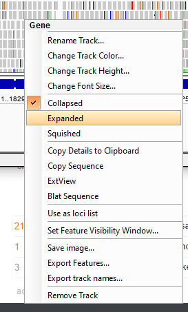
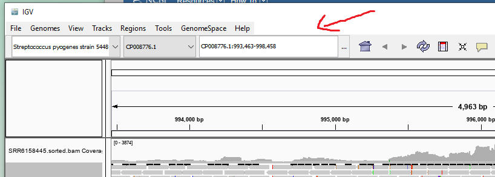
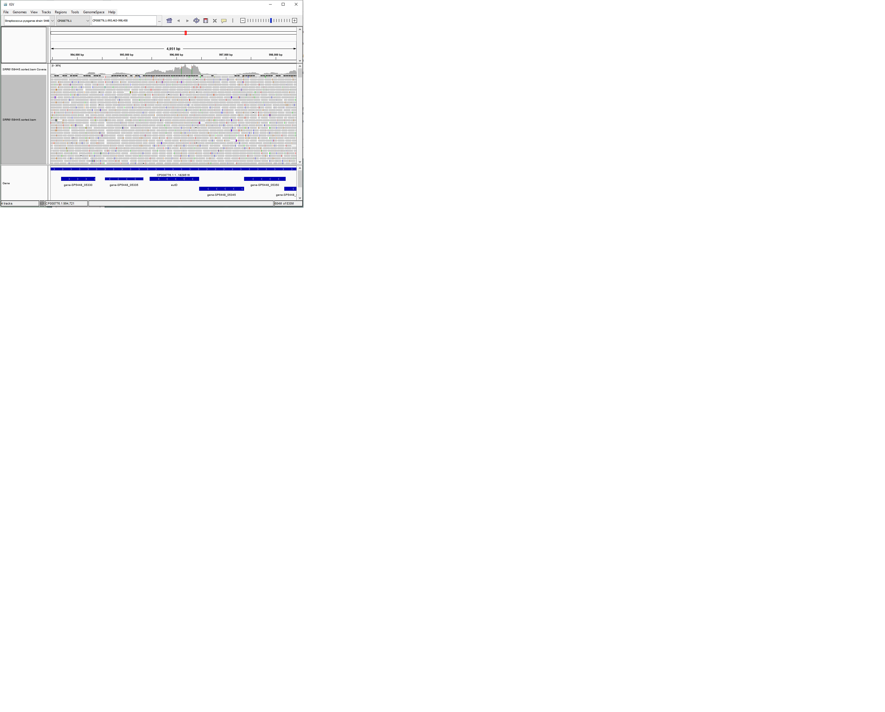
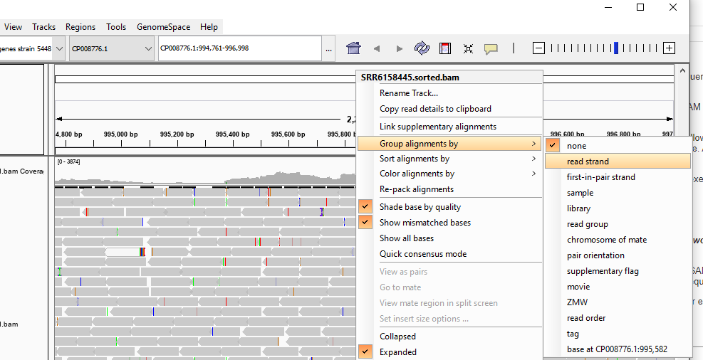

# 3-ii. Alignment Visualization with Integrated Genomics Viewer
 
## Obtaining IGV

For this assignment you will be downloading and visualizing your alignment results from last week (ASN1-3) on your own computer. If you do not want or otherwise cannot run this software on your computer, there are two PCs available in the lab with IGV installed.

[Integrated Genomics Viewer (IGV)](https://software.broadinstitute.org/software/igv/) is a piece of software published by the Broad Institute, a private non-profit biomedical research foundation and collaboration between scientists from MIT and Harvard. The program is written in Java and should run perfectly fine on either Windows or macOS. You can download IGV at the following link:

https://software.broadinstitute.org/software/igv/download

On Windows, you can run the installer normally. On macOS, you can open the Zip archive and drag the IGV app to your Applications folder in Finder. If you are running the newest macOS version, Catalina, you will need to follow the specific instructions on the download page.

## Preparing to visualize our results - Genome

There are two things we will need to visualize the way our reads alined to our genome, our alignment file and the genome. We will handle the genome first. In ASN1-1 we saw examples of both the sequence of a genome (a FASTA .fasta file) and annotation about what genes are present where (a GFF3 .gff/.gff3 file). We can use both of these files to provide IGV with all the necessary info about our genome.

You should have already downloaded the fasta file for the CP008776.1 *S. pyogenes* genome. I renamed this file `CP008776.1.fasta`. You will also need to download the GFF3 file for the same gene. You can do this the same way that you downloaded the FASTA file off of the NCBI website. Instead of choosing the FASTA format, just choose the GFF3 format and the file should download initially as `sequence.gff3`. Again, I renamed this file to `CP008776.1.gff3`. 

First, we will need to prepare a special .genome file for IGV usage. Do this by selecting the "Create .genome file" option:


 
And then provide the FASTA file and then select the GFF3 file for the "Gene file" option:
 

 
Clicking OK will ask you where to save the .genome file. I suggest saving this in the same folder as the .fasta and .gff3 files. 

This genome should automatically show up in the drop down menus at the top left just under the File/Genomes/View/... menu bar.

## Preparing to visualize our results - Alignments

Technically, we could download our .bam file and open it up directly in IGV at this point. However, it is a big file and would take a lot of RAM to open and store the entire file. We can help IGV out a lot by doing two things: sorting the file by read location and creating a special index file so IGV doesn't need to read the entire `.bam` alignment file to know which reads to show.

First, we need to go back to our `ASN3/spyo_data` subfolder. Use `cd` to navigate back to this directory and check that you have the `[SRA Accession].bam` file from last week.

We will need to sort and index our bam file in two steps. First, we will use the `samtools sort` function to sort by read position (the default).

```bash

samtools sort -@ 4 -o [SRA Accession].sorted.bam [SRA Accession].bam

```

In this case we call `samtools sort` with two arguments and then the input file. The first argument `-@ 4` tells the program to use 4 CPUs to sort sections of the file simultaneously and then merge them. The second argument `-o [SRA Accession].sorted.bam` tells `samtools sort` to save the output to the `[SRA Accession].sorted.bam` file. We could have just as easily omitted this argument and used the `>` redirection arrow to save the output to that file directly. This should take no more than a minute or two to run.

Now that we have a nicely sorted `.bam` alignment file, we can see how this re-arranged the alignment so that the positions increase:

```bash

samtools view [SRA Accession].sorted.bam | less -S

```

You can see that columns 4 and 5, the start and end coordinates, start with very low values, and increase as you go down the file. Remember to hit "q" to exist `less`.

**Q1) Both columns 4 (start coordinate) and 5 (end coordinate) should be generally ascending numbers. Which columns (start or end) did the program likely sort by (which one monotonically increases)?**

Finally, we can create an index to dramatically speed up IGV. We do this with another simple `samtools` command.

```bash

samtools index [SRA Accession].sorted.bam

```

This should also take less than a minute to run.

**Q2) Use `ls -lh` to identify what file `samtools index` created. How big is this file relative to the input `.bam` file?**

Now that we have the sorted BAM file and the index, which you identified in Q2, we need to download both of these to our own computers with WinSCP/Fetch. Do so and place in a folder of your choice. Make sure both files are downloaded and in the same folder. The alignment file should not be more than 1GB, so you should hopefully have plenty of space on your laptop.

## Visualizing our alignments in IGV

With IGV open and with our *S. pyogenes* genome selected, visualizing the alignments is as simple as dragging the `.bam` file from Explorer or Finder into the main window of IGV. You should see two lines in the far-left box and notes saying "Zoom to see coverage/alignments" in the main window. The default zoom is the entire genome of almost 2 million bases, which is far too zoomed out to visualize.

*It may help to close unnecessary programs on your computer at this point.*

First: I suggest changing the view in the bottom "Gene" pane. Right now you have a messy blue bar that is hard to interpret. If you right click that either the bottom left pane with "Gene" or the lower middle pane with the blue bar, you should get a context menu with various options. Select the "expanded" option for a more clear view of the genes.



You should also right click the pane with [SRA Accession].sorted.bam and change the same option to "Expanded".

Finally, we are going to zoom in. You can zoom in/out with the +/- buttons at the top right of the window, or you can choose individual genes or coordinate ranges directly by typing them into the text box just to the right of the genome selection dropdowns.



First, we will zoom in on the "*eutD*" gene. This gene codes for a phosphotransacetylase enzyme used for metabolism of a molecule called ethanolamine found in the human gut. If you type "eutD" in the search bar and hit enter, this should automatically zoom to a range around the *eutD* gene. This may take a few seconds as all of the reads in the range are processed and loaded, and this progress should be shown in the bottom left of the window. If all goes well, you should see something like this:



IGV has many many features that let you look at every detail of an alignment file like this, but also includes some high-level generalizations. At first, we can see that it is providing us with two types of info about our alignments. 

First, the top row contains "coverage" information. This is a calculation showing, for every base in the genome, how many reads overlap that position. This plot shows higher values for positions where substantial amounts of transcripts were present. In my example, we see that a region extending a bit beyond the start and end of the *eutD* gene has a substantially higher coverage than surrounding genes. This is because transcripts start before ("upstream" of) the coding sequence of a gene and end some distance "downstream".

**Q3)Make a qualitative assessement of the coverage of *eutD* and the neighboaring *gene-SP5448_05345*. Would you say there is a little more or a lot more *eutD* transcription? Why?**

Secondly, the bigger row just shows the name of our input alignment file on the left, and has a great deal of rectangular boxes in the main panel. Each one of these pointed-rectangles represents one sequence read: one set of four lines of our original FASTQ file and one line of our SAM/BAM file. 

The direction the pointed arrow is going represents the "direction" the read faces, which strand of the genomic DNA the RNA transcript originated from. You can see white arrows pointing to the left on each of these genes in the "Gene" pane at the bottom. This indicates that all of these genes are on the "bottom" or "antisense" strand of DNA, with their start at the right of the screen and moving to the left. Correspondingly, the RNA transcripts of these genes should be pointing in the same direction. 

We can use IGV to split up the reads by which strand they originated from:



Now we should have two rows of reads, one for the "top" strand and one for the "bottom" strand (you may have to scroll down a long way to find the extra row).

**Q4) With a rough estimation: how many reads aligning to *eutD* originate from the "top" strand of DNA (estimate the number of right-facing read boxes in the range of the *eutD* gene, found in the top row under the coverage row)?**

You may notice quite a few brightly colored marks on these. Each colored mark represents a single nucleotide in that read where the sequence in our data disagreed with the sequence of the reference genome file we got from NCBI. You may also see these colors on the coverage plot, with the vertical height of the colored bar being how many reads had a different base at that position. 

**Q5) Most of the color marks are randomly distributed in various reads and colors. What might cause these difference? Some of the marks are consistent in all reads at that position and are visible in the coverage plot. What could lead to all reads having a different sequence than the reference genome?**


 # 3-ii. Feature counting with HTSeq-count

## How do we know which read corresponds to which feature?

We have effectively generated a list of genomic positions where we found RNA molecules in our experiment. Remembering the first assignment, we looked at genome annotation files that similarly were a list of genomic positions of different types of biologically-relevant features. If we was very patient and thorough, we could simply go through these lists and cross reference the positions, find a read at position 82539982 of chromosome 15, look up this position in a genome browser, and see that this corresponds to an exon of the human ribosomal protein RPS17. This would take a *very* long time to do for a billion sequence reads. Fortunately, this process can be automated. Use a simple algorithm to run through each list and find which genomic regions overlap. 


There are some complications to this. What do you do when a read only partially overlaps a feature you care about? What if a read overlaps two genes? Is this because the read spans them or because the two genes themselves overlap? The above chart shows a number of these possibilities. The tool we will be using, HTSeq-count has three modes that deal with these in different ways. 

**Q6) Both intersection_strict and intersection_nonempty have largely similar results. In what situations do these assign reads differently? In what situations might the less-strict intersection_nonempty keep more information?**

## Running htseq-count

To start counting our features, we only need two things. The feature annotations and the aligned reads that will correspond to them. 

We are going to switch back to the human data we generated during the first section of ASN1-3, so change directory to that `ASN3` folder you were working in before. We had generated the SAM alignment file in the that assignment. The annotation we will use is similar to what we looked at in the first assignment but we will use the full genome this time.

```bash

wget ftp://ftp.ensembl.org/pub/release-86/gtf/homo_sapiens/Homo_sapiens.GRCh38.86.gtf.gz
gzip -d Homo_sapiens.GRCh38.86.gtf.gz

```

HTSeq-count has been pre-installed for you and is ready to go. We will run it with a command something like this:

```bash

htseq-count --mode intersection-strict --order name --type exon --idattr gene_id [SRA Accession].sam Homo_sapiens.GRCh38.86.gtf > [SRA Accession].counts

head [SRA Accession].counts
tail [SRA Accession].counts

```

We can see that HTSeq-count outputs two tab-delimited columns, with a label on the left and a number on the right. The top of the file looks pretty consistent, while the end has some unusual labels starting with two underscores `_` corresponding to some categories that could not be mapped to specific features.

Going back to a technique we covered last week, we can extract single columns from these kind of files using either `cut` or `awk`.

```bash

cut -f 1 [SRA Accession].counts | head
cut -f 2 [SRA Accession].counts | head

awk '{print $1}' [SRA Accession].counts | head
awk '{print $2}' [SRA Accession].counts | head

```

There is a companion to the `cut` command, aptly named `paste`. Instead of separating out a single column out of one file, `paste` can combine multiple inputs with columns into one columns. Make sure you have done the complete process of alignment and gene counting for both of our datasets to this point.

```bash 

cut -f 1 [SRA Accession 1].counts > gene_labels.txt
cut -f 2 [SRA Accession 1].counts > [SRA Accession 1].values
cut -f 2 [SRA Accession 2].counts > [SRA Accession 2].values
paste -d ',' gene_labels.txt [SRA Accession 1].values [SRA Accession 2].values > total_counts.csv

```

**Q7) Download the total_counts.csv file to your computer and open it in Excel, Google Docs other spreadsheet program. How many columns are there in this file? Find the sum of each numerical column. What do these columns add up to?**

Now that we have this sort of tabular summary of each gene in the genome, with values corresponding to the amount of RNA in each sample, we are ready to begin our statistical analysis! 

Next week, we will have count tables like this prepared for all of the samples in both experiments so we don't have to have everyone run 2 solid days worth of alignment and feature counting. You will work on a DataCamp assignment (ASN1-5) to get an introduction to R, a statistical scripting language that will allow us to use some very powerful analysis tools to follow up on these tables.
