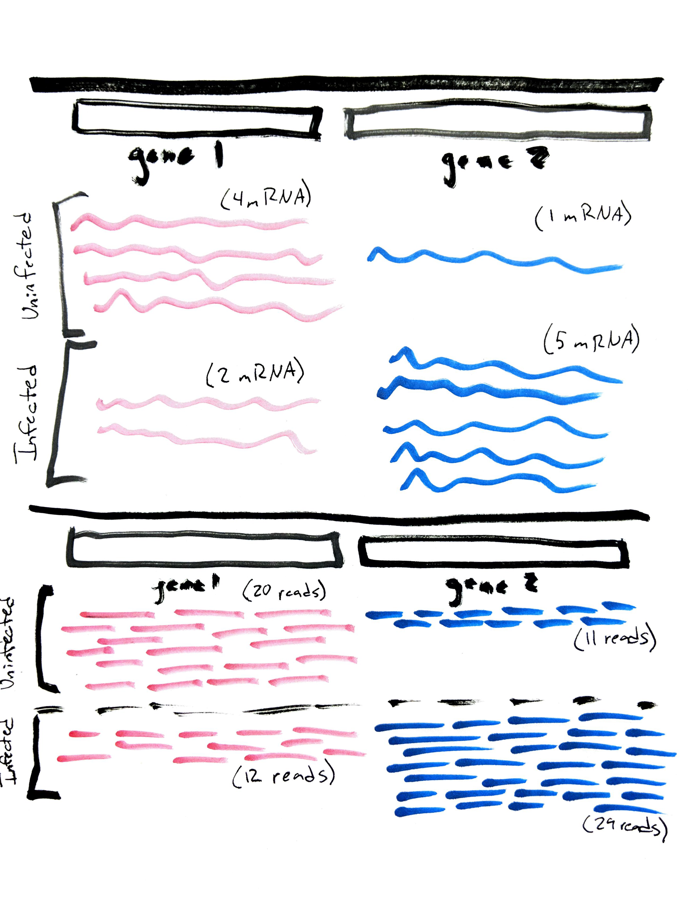
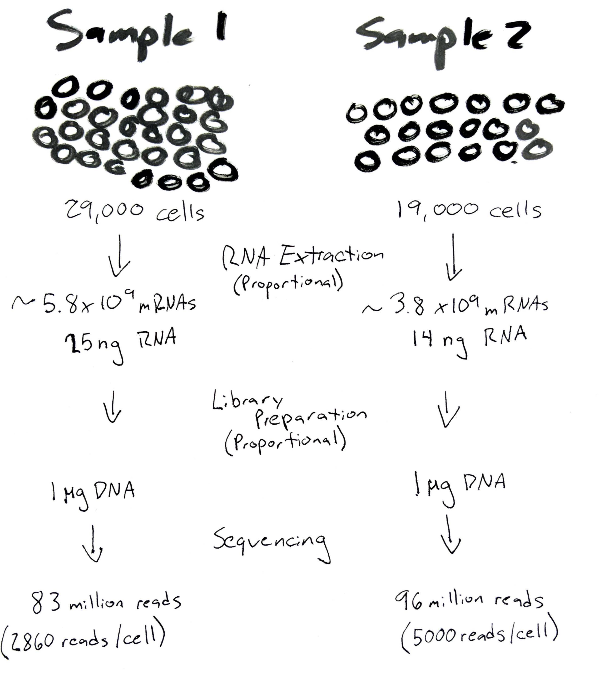
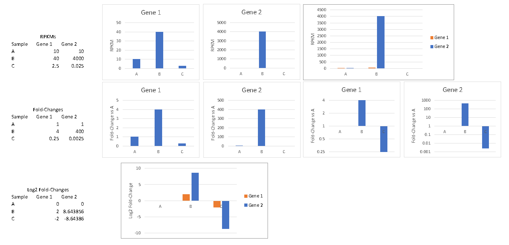

\**Note: This assignment has several associated questions you'll find as you go through this that need to be submitted on ELMS. Some of these ask you to explain or guess why certain things may be the way that they are. I am not grading on correctness here, rather I am grading based on whether you have completed the assignment and put some thought into the answers. Feel free to discuss these with your group or with me in lab. We will likely go over some of the more important material during class as well.*

**Q1) Please collect each successful command you run and submit these as answer 1. Specifically, submit the list of complete commands another student would need to run to precisely replicate the analysis you performed.**

# Submission

This assignment will be linked on ELMS and there should be a submission form for ASN5. You should submit this assignment individually. Feel free to work with and discuss the process and questions with classmates, but make please write your own answers!

# 3-i. Differential Expression



At its core, transcriptomics seeks to study differences in the abundance of distinct RNA transcripts. We start with different biological samples that all have different numbers of each mRNA (Upper half of figure). Through the process of sequencing and then alignment, we get a certain number of these sequence reads matching with each mRNA-producing gene sequence (Lower half of figure). The hope, if the experiment works as planned, is that the number of reads corresponding to each sequence is proportional to the number of mRNAs in the starting cell. This is usually the case, with a few caveats.



The first caveat is that during the multi-step process of transforming mRNA to DNA and then sequencing it, you effectively lose track of how much RNA was in each sample to begin with. If we start with slightly different amounts of cells, and our cells generally have the same amount of mRNA in each cell (similar samples should!) then the amount of RNA extract will be roughly proportional (if our lab tech is good). When we convert our purified mRNA into DNA for sequencing, we will end up with more DNA, probably roughly proportional, but depending on technique we might have more or less amplification in each sample. Finally, when we actually sequence each sample, the number of reads we get can vary significantly depending on some subtle properties of each sample as well as the evenness with which the lab tech mixes the samples together. It is very easy, at this step, to have substantially different amounts of reads for each sample, in any direction.

We might think this is going to cause us a lot of problems! What does it mean to have 100,000 reads for the BRCA2 gene in one sample and 200,000 reads for the same gene in another sample if those numbers are arbitrary based on the quirks of pipetting by our lab tech? If we could go backwards and calculate from the exact number of cells in each sample we might be able to normalize these numbers to the original number of cells. If the first sample has 100,000 reads for BRCA2 and 29,000 cells total then we could calculate how many reads from BRCA2 mRNA were found for each original cell (100000/290000~=3.5). *This makes a pretty big assumption: that all of the steps between counting 29,000 cells and sequence were all perfectly performed and identical for each sample* **This is a bad assumption to make.**

## Total read normalization

If assuming every step worked perfectly is out, how can we use this data? A safer assumption is that, rather than every step working perfectly the same on every sample, following the same protocol should treat each individual mRNA in each sample the same way. Put another way, if our protocol works well, we can assume that if we started with 10 picograms of BRCA2 mRNA and 20 picograms of TNF mRNA, we should get roughly twice as many reads mapping to the TNF gene than the BRCA2 gene. I am not going to prove this here, but over the years this assumption has been generally validated for common RNA-sequencing protocols and machines.

If we combine this assumption with the assumption that cells on average contain the same amount of RNA, we can compare the same gene in different samples by normalizing to the total number of reads. If there are 100,000 reads of BRCA2 in sample 1, which had 83 million reads total, we could assume that BRCA2 made up 1e5/83e6=0.12% of the total mRNA pool. If sample 2 had 96 million reads and reads with similar amounts of RNA per cell, then if these gene was identical in both samples, we would expect 0.12%\*96e6 = 115,662 reads of BRCA2 in sample 2. 

If sample 2 ends up having more reads, we would say that BRCA2 is "over-expressed" in sample 2 compared to sample 1, that the cells were making more of that mRNA, and probably more of the corresponding protein. If there are fewer reads, the opposite is likely true, that this gene is "under-expressed" in sample 2 compared to sample 1. 

**Q2) Assume that Sample A has 112 million reads and that Sample B has 78 million reads. We count the number of reads mapping to TNF in sample A and there are 300,000. If sample B had twice as much TNF mRNA to begin with, how many TNF reads would be expect to get from sample B?**

This simple normalization with the total number of reads found in each sample generally works well for comparing the same gene in each dataset. There are two additional, common complications:

1. If we want to compare two different transcripts in the same dataset, the number of reads each will get is proportional both to the number of mRNAs per cell, but also to the length of each transcript. Accounting for this leads to a very commonly used normalization method: RPKMs. This stands for Reads Per-Kilobase per Million mapped reads. RPKM = reads\*(1,000/transcript_length)\*(1,000,000/total_reads)  This accounts for both total reads (library size) and transcription length. Choosing to normalize to transcript length in kilobases and library size in millions of reads is largely historical and convenient: it results in nice numbers in the 1-4 digit range for most genes.
2. It is not always safe to assume that all cells have the same amount of RNA on average. Especially in the case that there are a few very highly expressed genes, it may be a safer assumption to assume that *most* genes are unchanged and present in similar numbers in all cells. There are a variety of methods that have been developed that utilize the number of reads coming from average genes, excluding extreme outliers in expression. These methods are often included in statistical software tool that analyze differential expression, and the normalization method used in our program, DESeq2, works something like this.

**Q3) One of our sequencing samples has 58 million reads. The CD70 transcript had 50,000 reads and is 911 bases long. What is the RPKM-normalized expression value for this gene in this sample?**

## Differential expression: fold-changes

Because gene expression (like many things in biology) can vary over a huge range, and both increases and decreases in RNA abundance can be equally important and interesting, we often choose to use logarithms to describe changes. 

Imagine this scenario. For a particular gene in sample A, we have twice as much RNA as in sample B. We can describe this relationship in the following ways, and all are equally valid:

- The gene is twice as expressed in sample A.
- The gene is expressed half as well in sample B.
- The gene is 2-fold increased in sample A compared to sample B.
- The gene is 2-fold decreased in sample B compared to sample A.
- There is 2x as much of the gene in sample A than sample B.
- There is 0.5x as much of the gene in sample B than sample A.

The first two are convenient, but only work with a few ratios for which we have nice english words. The second two work well, they are symmetric, so that the inverse of the ratio uses the same number (2-fold) but applies this to either an increase or decrease in abundance. The final two are perhaps most familiar for arbitrary ratios, and are directly describing the abundance. These have a big downside though, as a gene increases you get larger and large numbers, while decreases result in ever smaller fractions. This issue parallels an issue we have when trying to illustrate these types of changes graphically.



If we take a normalized dataset with three samples and two genes as shown above, we can describe the situation this way. We take sample A to be our "reference", a baseline or control sample. Both gene 1 and gene 2 have similar levels of expression in this dataset. In sample B both genes are increased substantially, by either 4-fold or 400-fold, while in sample C these genes are decreased by the same ratios. If we plot the normalized values directly, the plot for gene 1 looks pretty representative of what we expect, but because of the huge differences in gene 2, it is nearly impossible to tell the difference between samples A and C! It is also nearly impossible to compare both genes on the same plot.

One part of the puzzle of how to look at our data changes in comparison to our reference sample. In the second row we calculate the fold-changes between samples B/C and A. Sample A is always 1 (compared to itself!) while now the values for samples B and C are the fold-change ratios with A. When plotted directly this doesn't improve the situation, but if we change the axis to be a logarithmic axis, now we start to see that symmetric relationship between over- and under-expression we mentioned earlier.4

One final touch, which we tend to use when doing lots of math or statistics, is to formalize this by applying the logarithmic transformation not just to the plot, but directly to the fold-change ratios we calculated. If we simply take the base-2 (or base-10) logarithm, we get log fold-changes which we can plot directly, and get that same symmetric relationship, doubling or halving a value has the same magnitude of change when we visualize it, just in different directions! Many of the tools we might use for expression analysis take advantage of this log-transformation technique both for visualization as well as for statistical purposes.

**Q4) If a gene has 28000 normalized reads in sample A and 49000 in sample B, what is the fold-change of this gene in sample B compared to sample A? What is the log2 fold-change?**

## The final component: experimental design

So far we have looked at differences between individual samples. We could imagine extending this to experiments with multiple replicate samples easily enough. Just averaging the normalized read counts for each gene among replicate samples should work well enough. For the simplest experiments, a comparison of two sets of samples with only a single experimental variable, direct calculation of the ratios between genes, combined with some simple statistics analogous to a t-test would be sufficient. 

Unfortunately, things are rarely this simple, and we would like to do experiments that efficiently capture the differences caused by several variables, or to account for extraneous variables like experimental batch. Now this is more complicated, if we have several variables, how do we do calculate what the differences are?

If we do an experiment where we test every possible combination of variables, each with sufficient replicates, we could do individual, pairwise comparisons for every variable we care about. If we have two variables, for instance: infected vs uninfected and 4 hours vs 24 hours vs 48 hours, there are six possible combinations. 

| Sample | Time | Infected |
|--------|------|----------|
| A      | 4    | Yes      |
| B      | 4    | No       |
| C      | 24   | Yes      |
| D      | 24   | No       |
| E      | 48   | Yes      |
| F      | 48   | No       |

We can compare uninfected/4hours vs infected/4hours and get some effect due just to the infection. We might also compare uninfected/24hours vs infected/24hours and get another effect due just to the infection. These effects will probably be different even though the both seem to be our effect from "infection"! This is because different variables can *interact*, having one variable change can itself modify the differences created by another variable. For this reason, we tend to model our experiments as having effects from individual values of each variable (4 hour effect, or a 24 hour effect) as well as the individual interactions (infected+4 hour or uninfected+24 hour). 

Without going into the justification, a common way to handle this is to deal with log-transformed count data, and assume that these effects can be added together to get the final expected value. (Adding logarithms is like multiplying base numbers, and in biology effects on transciption tend to be multiplicative). Fortunately, even with complicated multi-variable experimental designs, these types of linear models are approachable and (relatively) easy to solve with techniques known as Generalized Linear Models (GLMs). 

We aren't going to learn how GLMs work, but it is important to understand that what we are doing is starting with some arbitrary baseline sample (Uninfected + 4 hours) and calculating from the data what effect each variable or combination of variable has on the expression of each gene. Essentially for every gene and every sample you have an equation:

- Expr(Infec. + 24h) = Expr(Baseline) + ΔExpr(Infec.)+ ΔExpr(24h) + ΔExpr(Infec. \* 24h) + random error

The program combines many thousands of these into one giant system of equations and tries to find a solution that best explains the data by finding the effect of every variable on every gene. When it finds that best answer, those values are our estimated log-fold changes due to that variable!

In this way we can have a complicated multi-variable experiment and simultaneously estimate the effect from all of the variables, as long as we have samples that cover enough of the variable possiblities for the system of equations to be solved. In effect, this means you need to make sure that you have either every variable combination, or at least one type of sample in which each variable has been isolated from all of the other variables.


# 3-ii. Differential Expression Analysis with DESeq2

The tool we will use for differential expression analysis in this stream is called DESeq2. This is available as a library for the R programming language. You may have been exposed to a program called RStudio in the past. This is a graphical program that lets you use the R interpreter like you have in the DataCamp ASN4, but also includes a text editor and graphical viewers for individual variables and files. For this lab we will use a special version of RStudio, called RStudio Server, that is available via website and runs on the same server that we connect to the command line via Termius. To access RStudio Server, browse to http://tod-compute.tryps.in:8787 and log in with the same username and password you use to connect to TOD-Compute in Termius.


You can find a brief explanation of the different parts of RStudio and what you might want to do with them at the following video:

- https://youtube.com/video

DESeq2 is available at 

- https://bioconductor.org/packages/release/bioc/html/DESeq2.html

To ensure that everyone can successfully use the R libraries, I've pre-installed these on the tod-compute server. We will load this directly with the command below in the R terminal.

```r
library(DESeq2)
```

Running these should take a few minutes and generate a lot of output.

DESeq2 includes an excellent, if technical, walkthrough of how to complete expression analysis on their website

- https://bioconductor.org/packages/release/bioc/vignettes/DESeq2/inst/doc/DESeq2.html

We will cover the basics, focusing on the methods we are using in this lab, in this assignment. To perform an analysis of different expression we will need a few things:

1. Expression data: this is our counts generated by HTSeq-Count
2. Experimental design: this is the information telling us which what variables exist and which value each sample corresponds to.

The expression data for our datasets can be found in the "aln" subfolder of each data folder. For instance, the *T. cruzi*-fibroblast data is found in `/mnt/storage/data/tcruzi`, so the aligned and counted data is found in `/mnt/storage/data/tcruzi/aln`. If you open up Termius or use the "Terminal" tab in RStudio (which does the same thing!) you can see that there are three files for each sample: a `.alnstats` file containing the summary output from Hisat2, a `.bam` file with the aligned reads, and a `.counts` file containing the counts for each gene in the human genome in that sample. This third file provides the expression data we need for our DESeq2 analysis.

```bash
#This command runs in the commandline/terminal
ls /mnt/storage/data/tcruzi/aln
```

The second thing we need is a description of the variable values for each sample. We are going to have three variables here, infected status, timepoint, and experimental batch. I have already prepared a table (just using Excel manually!) with the file names of each sample, as well as the values for each variable. This file is found at `/mnt/storage/data/tcruzi/sampletable.csv`. You can either view this with the command line, navigate to and open this file in RStudio, or download it using WinSCP/Fetch.

**Q5) What labels are we using for each of the three variables? What are the values used for each one?**

We can load this into R by using the `read.csv` function

```r
sampleInfo <- read.csv('/mnt/storage/data/tcruzi/sampletable.csv')
```

DESeq2 includes a special function for directly importing HTSeq-count data, which is perfect for us! This function, named `DESeqDataSetFromHTSeqCount`, needs three things. It needs the location of the directory with our files, a table containing the sample names, file names, and variables, and finally a description of the experimental design we are using.

The first is easy

```r
directory <- '/mnt/storage/data/tcruzi/aln'
```

The second requires us to generate a specially labeled "data frame" or table.

```r
sampleTable <- data.frame(sampleName = sampleInfo$Filename,
                          fileName = sampleInfo$Filename,
						  infected = sampleInfo$status,
						  timepoint = sampleInfo$time,
						  batch = sampleInfo$batch)
```

Finally, specifying an experimental design uses a special feature of R that is designed to simplify these into simple expressions. We combine these all into a call to `DESeqDataSetFromHTSeqCount`.

*A note: this step, collecting the information, picking and describing your samples, and getting this imported into DESeq2 for your group's experimental samples is going to be the first and most important step in your project! You will need to construct your own sample table and possibly collect `.counts` files from multiple directories into one place.*
*Your experiment may ideally be consideraibly simpler than this exapmle!*
```r
dds <- DESeqDataSetFromHTSeqCount(sampleTable = sampleTable,
                                       directory = directory,
                                       design= ~ infected + timepoint + batch)
```

Oops! While this command did run successfully (after a delay while loading all of the data), you probably got a chunk of red text with a warning telling you that "the design formula contains one or more numeric variables with integer values, specifying a model with increasing fold change for higher values." This is an important warning! 

Normally, when we are doing differential expression analysis we care about the differences that changing a variable causes, looking for differences between two conditions. For instance we might care about the difference between infected and uninfected, or between 24 hours post-infection and 4 hours post-infection. DESeq2 uses R's built-in design tools which are often used in a different way, with quantitative variables, for instance a person's height in inches. As you saw earlier, the values in the "timepoint" columns were just numbers, so R has defaulted to treating these as numeric values which lie on a continuum, instead of being distinct values. 

The warning message tells us how to solve our problem: "did you mean for this to be a factor? if so, first convert this variable to a factor using the factor() function." We can replace `sampleInfo$time` with `factor(sampleInfo$time)` and force R to treat these values as distinct categories.

<a href="http://www.youtube.com/watch?feature=player_embedded&v=uvPmk4C4wgA" target="_blank"
></a>

```r
sampleInfo$time
factor(sampleInfo$time))
```

First we can look at the difference betweent hese two values. The first is simple a list of numbers, while the second, a `factor`, additionally contains all of the possibile values that may be in this list. 

```r
sampleTable <- data.frame(sampleName = sampleInfo$Filename,
                          fileName = sampleInfo$Filename,
						  infected = sampleInfo$status,
						  timepoint = factor(sampleInfo$time),
						  batch = sampleInfo$batch)
dds <- DESeqDataSetFromHTSeqCount(sampleTable = sampleTable,
                                       directory = directory,
                                       design= ~ infected + timepoint + batch)
dds
```

Now, `dds` is a variable that contains the entirety of our experiment! Note that this last line (simply outputing the value of `dds` shows us a summary of what this object holds. It has the size (dim/dimensions, number of genes and samples), it contains the row names (genes) and column names (samples), as well as the names of the variable information we provided!

At various points we will run a part of the analysis by calling a function (like `DESeqDataSetFromHTSeqCount()` which returns a value) and we use `<-` to save this to a variable, in this case `dds`. In general, simply entering a variable name on the interpret will cause R to print out a convenient representation of this variable to the screen. We will do this again throughout this assignment.

First: we will run a quick filter to remove genes that always have extremely low counts, partly because they are likely unimportant to us and partly because it will make all of this run much faster! 

```r
keep <- rowSums(counts(dds)) >= 100
head(keep)
```

The first line calls `rowSums()` to determine how many counts were present for each gene across all samples, tests whether this is >= 100 and saves this True/False list for every gene to `keep`. Much like how the `head` command in the terminal causes just the first ten lines of some input to be output, the `head()` function can show us just the first part of some variables in R.

```r
dds <- dds[keep,]
dds
```

Next, we use this True/False boolean list to select only the rows from our dataset with >= 100 reads in total.

**Q6) Compare the output of listing the dds object before and after we did the filtering (scroll up in the window to see the previous output). What changed? Does this make sense given what the filtering with the `keep` variable was meant to do?**

You can take a direct look at the data by running the following function. This will generate a table containing all of the gene read counts and save this to a variable called `dds_counts`. You should either print this to the screen or use the Environment tab in the top right of RStudio to look at the content of this table. This table reprsents the sum of what you might have created in ASN1-4, a list of counts for every gene in the genome for every sample in the experiment.

```r
dds_counts <- counts(dds)
```

The last step in preparation for running our analysis is mostly for convenience. In the introduction of this assignment, we learned that these analyses pick a baseline combination of variables that all samples will be compared to. If we don't specify what we want, DESeq2 can't read our mind! It will just pick whichever variable values come first alphabetically. We can use the `relevel` function to take in an existing factor and set the reference level explicitly. We probably want to compare infected vs uninfected, and 6/12/24/48/72 horus versus 4 hours, so we set Uninfected and 4hpi as the baselines.

```r
dds$infected <- relevel(dds$infected, ref = "Uninfected")
dds$timepoint <- relevel(dds$timepoint, ref = "4")
dds$batch <- relevel(dds$batch, ref = "A")
```

All of these functions have been called on some data and then assigned the result back to the `dds` object, so we have been modifying it in place and should not be seeing output. The `dds` object now contains the complete experiment, minus low-expression genes, and with the baseline samples set to 4 hour post-infection, uninfected samples from batch A.

Now, we run the wildly complicated process of taking this data matrix of almost a million samples with a dozen or more variable combinations, normalizing these to library size, estimating and fitting dispersion factors, and fiting a negative binomial GLM model and computing Wald statistics...all of this is done by running the command:

```r
dds <- DESeq(dds)
```

Not so hard was it? While easy for you, this will probably take the computer some time to crunch the numbers. You've now completed a state-of-the-art differential expression analysis on a complicated large scale human transcriptome experiment. Now what we have left to do is...examine the results.

```r
res <- results(dds)
res
```

Wow, there is a lot going on here. In addition to the header, this data table is has six columns, and a row for every gene. We'll go through these one by one.

Header:
1. `log2 fold change (MLE): batch B vs A` This is telling us that by default DESeq2 is returning results for the batch B vs batch A comparison, and giving us log2 fold changes.
2. `Wald test p-value: batch B vs A` This is telling us that by default this is performing a statistical "Wald test" to determine the signficance p-values
3. `DataFrame with 27308 rows and 6 columns` Finally, this is telling us the content of these results are a table with 27308 rows (each representing a gene) and 6 columns.

Table:
1. `baseMean` is the normalized read count for the baseline samples
2. `log2FoldChange` is the log2 ratio of the condition listed at the top (Effect of batch B to baseline batch A) to the baseline (4hr uninfected batch A)
3. `lfcSE` is a special "shrunken" version of the log2 fold change that accounts for low-expression genes have inflated differential expression due to high variance.
4. `stat` is an intermediate statistic value used for calculating the p-values, we won't use it at all.
5. `pvalue` is the...p-value of the comparison, low numbers mean the difference is statistically signficant at a stronger level
6. `padj` is an adjusted p-value taking into account the fact that we are simultaneously performing tends of thousands of tests, so just by chance we should get "signficant" p-values occasionally. This affects borderline p-values more than the lowest p-values.

We an generate a summary of these results:

```r
summary(res)
```

This gives us a summary of the results, first telling us the scale of the comparison, with 27,308 genes, the cutoff for significance (a p-value below 0.1), and finally the number of genes with specific log fold-change (LFC) values or other categories.

**Q7) How many genes are over-expressed in batch B compared to batch A? How many are under-expressed?**

Like we mentioned before, there are many comparisons that can be made with all of our combinations of variables, and DESeq2 has calculated the effect of all of those possibilities. Perhaps the comparison of batch B vs batch A is not the most biologically relavent comparison we could make... We can see a list of these comparisons, or "contrasts"

```r
resultsNames(dds)
```

This gives us all of the direct comparisons between variables extracted from our data model. We can access these results, and use them to generate the same type of results table we got with `results(dds)` earlier. This can be done either by directly giving the `results` function the text name of the result we just listed, or we can specify a contrast by giving it three things: a variable name, the comparison level, and the baseline level of that variable:

```r
res_24v4 <- results(dds, name="timepoint_24_vs_4")
```

```r
res_24v4 <- results(dds, contrast=c('timepoint', '24', '4'))
```

Running either of these commands should have the same results. Reminder: these commands save the output to the `res_24v4` variable and will not have output on the screen. The first uses one of the pre-included comparisons of one possibility (24 hours post-infection) to the baseline (4 hours post-infection). 

**Q8) Using the same `summary()` function as we used previously, we can get a summary out of this new `res_24v4` results variable. How many genes are over-expressed at 24 hpi compared to 4 hpi? How many are under-expressed?**

The power of the second command, however, is that we can generate comparisons for experimental conditions that do not include the baseline comparison. For instance, if we wanted to identify genes differentially expressed between 24 and 48 hours, we can do so with the `contrast` argument.


**Q9) Using the same `results()` function with the `contrast=` argument as we used previously for 24v4, generate a results table for 48 hours vs 24 hours post-infection. How many genes are over-expressed at 48 hpi compared to 24 hpi? How many are under-expressed?**

We can either export these results tables by saving them to a CSV file, downloading them, and opening them in a spreadsheet program like Google Sheets or Microsoft Excel, or we can use R functions to investigate them directly.

```r
write.csv(as.data.frame(res_24v4), 
          file="Tcruzi_24hpi_vs_4hpi.csv")
```

This should create a `.csv` file in your home folder which you could download and open in Excel or Sheets much like the counts tables generated by `cut` and `paste` in ASN1-4, but containing the differential expression results from DESeq2.

Or for instance, we can remove any results with adjusted p-values above 0.05 and sort them by significance:

```r
res_24v4_signif <- subset(res_24v4[order(res_24v4$padj),], padj < 0.05)
res_24v4_signif
```

**Q9) What is the most signficantly differentially expressed gene at 24 hours post infection? What is the name of this human gene and what is its general function? (You need to look this up on the internet)**


While there are many things we might do with these results, most will involve various subsequent steps processing the exported results tables for each comparison we care about. One additional feature DESeq2 has is the ability to generate plots showing the overall level of differential expression in a results set.

```r
plotMA(res, main="Batch B vs Batch A")
plotMA(res_24v4, main="24 HPI vs 4 HPI")
```

You can switch back and forth between graphs by hitting the left and right arrows above the plots.  In these plots, known as MA-plots, each datapoint represents one feature or gene. The position on the X axis represents the average level of expression, on a log axis. The location on the y-axis shows the log2 fold-change, where positive values mean more expression compared to the baseline, and negative values mean lower expression. By default, red colored genes are statistically significant at p<0.1.

**Q10) Compare the plots of the batch B vs batch A and the 24hpi vs 4hpi results. Which comparison has more differential expression? Given the relative importance of our batch and time point variables to our experiment, what does this tell you about the importance of controlling for batch effects in the analysis?**

MA-plots are valuable exploratory tools for understanding in general how big the effects were from changing each of our variables. This experiment used multiple time points to identify time-dependent changes in infection response. By comparing the vertical distribution of the points and the number of signficant (red) genes, we can quickly identify which pairs of conditions were more similar or distinct.

**Q11) In the same way you calculated and plotted results for 24 hpi vs 4 hpi, repeat this for the 6v4, 12v4, 24v4, 48v4, and 72v4 comparisons. 6 hours and 4 hours are very close and have very few differences. At what point would you say there are moderate changes in gene expression since 4 hours post-infection? At what point do you see dramatic changes?**

You likely see dramatic differences between 72 and 4 hours post-infection. Intuitively, we would expect to see the biggest differences between the most distant comparison. This isn't a product of just including 72 hours, since we would likely see many fewers differences betwee 72 hours and 48 hours post-infection.

As another example of a biologically-motivated question, we might ask whether the most significant changes happen on day one (24 hpi vs 4hpi), day two (48 hpi vs 72 hpi), or day three (72 hpi vs 48 hpi). 

**Q12) Using either `plotMA()` and `summary()`, determine which of the three days in this experiment had the most change in gene expression (more red genes in the plots). How many genes had signficant log fold-changes (LFC) on each day?**


