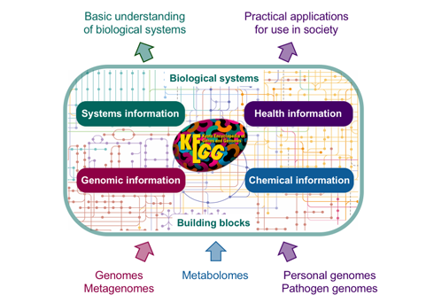

\**Note: This assignment has several associated questions you'll find as you go through this that need to be submitted on ELMS. Some of these ask you to explain or guess why certain things may be the way that they are. I am not grading on correctness here, rather I am grading based on whether you have completed the assignment and put some thought into the answers. Feel free to discuss these with your group or with me in lab. We will likely go over some of the more important material during class as well.*

**This assignment follows directly from ASN1-6 and you will need the DESeq2 processed datasets from ASN1-6 to complete this assignment. The `dds` object may still active in your RStudio session, but if it is not you will want to use your recorded commands from ASN1-6 Q1 to regenerate this variable.**

**Q1) Please collect each successful command you run and submit these as answer 1. Specifically, submit the list of complete commands another student would need to run to precisely replicate the analysis you performed.**


# Submission

This assignment will be linked on ELMS and there should be a submission form for ASN1-7. You should submit this assignment individually. Feel free to work with and discuss the process and questions with classmates, but make please write your own answers!

# 4-i. Gene Set Enrichment Analysis


Previously we've analyzed a transcriptome dataset to identify and quantify the gene expression responses to specific variables. We get this in the form of a nice sortable table containing the level of expression, the degree of change between conditions, and the statistical significance of this change for every gene in our data. We can sort and filter this list so that only significantly differentially expressed genes are in our list, but going through this manually can quickly become infeasible. A common way to begin interpretation is gene set testing. Instead of looking at the meaning of individual genes, we can ask whether specific types, classes, or sets of genes are generally found to be differentially expressed in our data. This aims to understand what pathways or regulatory networks our differentially expressed genes are in.

There are multiple ways to do this type of testing, but perhaps more importantly there are many ways to classify and sort genes into sets in biologically relevant ways. Two broadly applicable methods are known as KEGG pathways and Gene Ontology annotations. These are both rich sets of annotation which are used to describe the biological context of genes in a larger framework of metabolic pathways or hierarchical layers of understanding. 

**Q2) What does it mean for a gene set to be enriched?**

## Biological Pathways

Biological pathways can take several forms, they could be chemical reaction pathways, information about what chemical molecules are present, how these are converted from one to another, and one enzymes are responsible for catalyzing those individual reactions:


There are also gene regulation pathways, representing the relationship between different regulatory components which individually may up-regulate or down-regulate the expression of other genes. These can be complicated and interconnected and underly much of how biological can respond to complex environments and demands:


Finally there are signal transduction pathways, relationships between different components with form a physical communication network that handles a signal from an input sensor, transmits this to another component by chemical modification or binding, eventually transfering this information to an output component like a regulatory protein or enzyme.


In general, pathways represent interconnected components and processes where the nodes are usually physical entities like chemical metabolites or gene products like proteins or RNA, and the connections between them represent processes like chemical reactions or regulatory events.

**Q3) Which of these types of pathways do you think your group might investigate for your projects?**

## KEGG Pathways

https://www.genome.jp/kegg/kegg1a.html

KEGG, the Kyoto Encyclopedia of Genes and Genomes is a resource focused on providing a variety of annotation and classification of genes based on the concept of biological pathways. KEGG is perhaps the single most popular database for biological pathway information.



KEGG resources can be split into four main types:

1. Systems information: these include specific descriptions of pathways which can be any of the previously described types of biological pathways.
2. Genomic information: Information about genes, genomes, and the evolutionary relationship between genes in different organisms.
3. Chemical information: Information about individual biological chemicals, molecules not made as gene products. This also includes representations of specific chemical reactions or types of enzymes.
4. Health information: Sets of information collecting the relationship of elements in the previous types with various health outcomes like disease or drug response.

These individual databases are all interrelated, with the components of biological pathways being references to entities described in the genomic information or chemical information databases, often cross-referenced to other sources.

For GSEA, we can use the membership of genes and gene products in different biological pathways to test for the overrepresentation of genes in particular pathways in our datasets.

## Gene Ontology

http://geneontology.org/docs/ontology-documentation/

Gene Ontology (GO) is both a database as well as an ambitious project to develop a comprehensive model of biological system from the molecular level up. The goal is to represent the knowledge about individual biological units like genes in standard, interrelated terms. The terms used in GO fall into three categories:

- Molecular Function: MF terms describe what gene products do on a molecular level and represent activities rather than objects. These range from general descriptions of what gene products do like catalysis, transport, or binding to very specific descriptions like adenylate cyclase activity of Toll-like receptor binding.
- Cellular Component: CC terms describe a location or place. This can describe where a gene product goes, like the nucleus or cell membrane, or they can describe a complex that the product is part of, like a ribosome or cytoskeleton.
- Biological Process: BP terms describe gene products by the larger process or program that they fit into in the context of biology. Rather than describing an anatomical place or the specific activity of that individual gene product, these describe broader concepts like DNA repair or purine nucleobase biosynthesis. This is similar to, but less specific or formal than description of a specific metabolic reaction pathway.


A unique feature of Gene Ontology annotation is the way that GO terms interrelate. More specific terms are defined as being specific examples of more general terms. This is a flexible hierarchical relationship described by a graph structure shown above. At the most specific level are the general terms `biological_process`, `cellular_component`, and `molecular_function` themselves. All terms are eventually connected to these core terms. In this example, we look at a specific GO term, GO:0019319 or "hexose biosynthetic process". This is a Biological Process term describing gene products involved in the production of hexose sugars. A powerful feature of using GO terms is that specifc terms can also represent all of the less-specific parent terms. If we are describing the activity of a gene involved in producing hexose sugars, it is just as valid to describe it and performing a "carbohydrate metabolic process" or a "small molecule metabolic process". 

The structure of the Gene Ontology database means that we only need to label a gene product with the most specific annotation and our analyses can generalize this as much as is necessary. If a sample had disregulation of carbohydrate biosynthesis in general, we could detect this without needing every single gene involved in any process related to carbohydrate biosyntehsis to be labeled with that specific term. More specific terms will have fewer genes associated, but also give us a more powerful, specific understanding when analyzed for enrichment. Tools for GO enrichment often take this graph structure into account and can automatically find enrichment of terms at any level without needing incredibly complex and dense gene annotation.

GO is often less specific than KEGG annotation and does not point directly to individual steps in specific pathways, but in exchange can more easily describe general conceptual processes that can aid or understanding of our data.

**Q4) Which category or categories of GO terms (MF/CC/BP) do you think will be most relevant for understanding your group project questions, and why?**

## MSigDB Collections

http://software.broadinstitute.org/gsea/msigdb/index.jsp

The MSigDB or Molecular Signatures Database is a resource curated by the Broad Institute which provided manually curated sets of genes associated with a variety of biological conditions. These include general sets like the Hallmark gene set which includes 50 sets of genes associated with very broad biological states such as angiogenesis, hypoxia, or estrogen response. These also include much more fine-grained gene sets collected from thousands of individual publications. In total there are eight collections. 

1. hallmark gene sets: 50 broadly applicable sets of genes representing general biological cell states
2. position gene sets: gene sets corresponding to the different regions of each of the human chromosomes
3. curated gene sets: 5500 gene sets, in some ways a much finer-grained general collection like the hallmark sets
4. motif gene sets: 831 sets based on computationally-identified shared regulatory sequences
5. computational gene sets: 858 gene sets based on co-expression in large-scale microarray data
6. Gene Ontology gene sets: almost 10,000 gene sets based on Gene Ontology annotations
7. oncogenic signatures: 189 gene sets representing pathways often mis-regulated in cancer cells
8. immunologic signatures: 4872 gene sets representing cell states or regulation in the immune system

This dataset is only provided for the human genome, although there are translations available for some popular related genomes.

**Q5) Which of these gene sets do you think will be useful for answering your group project questions, and why?**

# 4-ii Performing GSEA in R

We will be performing GSEA on our previous dataset using both GO, KEGG, and an example set of MSigDB gene sets. Although there are a variety of tools we can use, some of which can handle all of these types of annotation, we will be using different software packages, each with their own advantages, for each type of annotation.

## Gene label translation with the human genome annotation

When we ran `htseq-count` we specified that we wanted each of our genes labeled with the `gene_id` annotation. As we used an Ensembl annotation of the human genome, these labels look like: `ENSG00000068903`. These have the advantages of being clear and unambiguous, but are opaque without looking them up in a database. Different sets of annotations may use different labels, for instance the gene symbol: `SIRT2` or the Entrez ID: `22933`. The symbols are directly useful because these are the standard gene symbols that people use to refer to genes and generally are an abbreviated form of their full name. Unfortunately, there is no guarantee that these are unique, and different genes from different genomes or organisms may have the same symbol. Entrez IDs are similar to Ensembl IDs, but are managed by NCBI instead of EBI. Fortunately, for the human genome these annotations are well cross-referenced and we can easily switch between then.

We will mostly be using our results generated from ASN1-6. Remember, the results for individual comparisons will be 6-column data result objects that look like this:

`head(results(dds))`
```
log2 fold change (MLE): batch B vs A 
Wald test p-value: batch B vs A 
DataFrame with 6 rows and 6 columns
                        baseMean     log2FoldChange              lfcSE
                       <numeric>          <numeric>          <numeric>
ENSG00000000003 323.481451473342  0.188901578428889 0.0887301468712075
ENSG00000000419 455.970119959153 -0.443916566780174  0.124328170044373
ENSG00000000457 211.118786110725 -0.194293658892685  0.104970855841154
ENSG00000000460 164.778045735966 -0.226074152044942  0.175637022766634
ENSG00000000938 2.12141291467678   1.24486064260785  0.709449120843628
ENSG00000000971  1086.9642711077   1.14065909211072  0.228762959160063
                             stat               pvalue                 padj
                        <numeric>            <numeric>            <numeric>
ENSG00000000003  2.12894472836928   0.0332588335727604   0.0842699317739631
ENSG00000000419 -3.57052280767696 0.000356269429584115  0.00186544775845506
ENSG00000000457 -1.85092954930936   0.0641796890329054    0.142963671134043
ENSG00000000460 -1.28716684263843    0.198036141512684    0.340449816677675
ENSG00000000938  1.75468628550494   0.0793129831556036    0.168928344450736
ENSG00000000971  4.98620535552967 6.15766954516744e-07 7.06495575924718e-06
```

If you don't have `dds` object and the above command does not work, you will need to perform the basic analysis from ASN1-6. This includes loading the dataset and running the `dds <- DESeq(dds)` command.

You may notice our Ensemble IDs are found in an unlabeled column before the 6 named data columns. This is because these are the row names for this table. We can access these directly with the `rownames()` function. 

```r
resInfect <- results(dds, contrast=c('infected', 'Infected', 'Uninfected'))
rownames(resInfect)
```

All of our methods today can utilize the gene symbols directly, so we can translate these names to the standard gene symbols. The first, confusingly named, library we installed includes the data and functions necessary for us to do this:

```r
library(org.Hs.eg.db)

mapIds(org.Hs.eg.db, rownames(resInfect), column="SYMBOL", keytype="ENSEMBL")
```

This function, `mapIds`, takes the annotation object `org.Hs.eg.db`, the list of IDs to translate, and two special arguments telling it what we want it to translate. The `column` argument tells the function which column in the annotation object we want, in this case `"SYMBOL"` containing the gene symbols, while the `keytype` argument tells this what type of IDs we are giving as input, as not all types are unambiguous like Ensembl IDs. We will be using this function often to translate different sets of genes into lists of gene symbols. 

One final note is that not all of the genes present in the Ensembl annotation may have gene symbols. In this case the value for the symbol will be a `<NA>`, a special value indicated lack of a value. We may choose to filter these out for later steps.

**Q6) What is the most overexpressed gene in the infected vs. uninfected comparison? You may need to re-visit ASN1-6 to remember how to answer this.**

## MSigDB gene set enrichment with fgsea

https://bioconductor.org/packages/release/bioc/html/fgsea.html

We will start with GSEA of some MSigDB gene sets. These can be downloaded from http://software.broadinstitute.org/gsea/msigdb/collections.jsp although all of the gene sets have been downloaded and are present in `/mnt/storage/data/msigdb`. 

`fgsea` works with very simple statistics based on the concept of ranks. We rank our genes by sorting from the most extreme down-regulation to most extreme up-regulation. The program then takes individual gene sets and asks whether the distribution of these genes across the ranks is different than would be expected from randomly distributing the genes. 

First, we will load the hallmark gene sets for human genes.

```r
library(fgsea)

hallmarks <- gmtPathways("/mnt/storage/data/msigdb/h.all.v7.0.symbols.gmt")
head(hallmarks)
```

`hallmarks` is now a list, where each element in the list is one gene set represented by a vector of `character` strings. Because we chose the `.symbols.gmt` file instead of the `.entrez.gmt` file, the genes are represented by their symbol. This list-of-vectors is suitable for input to the `fgsea` analysis.

The second element we need is our list of genes and their associated fold-change sorted by expression. To work with the `fgsea` analysis, we should use a numeric vector of logFCs where the names are the gene symbols. We will make this in a few steps.

```r
logFCs <- resInfect$log2FoldChange
names(logFCs) <- mapIds(org.Hs.eg.db, rownames(resInfect), column="SYMBOL", keytype="ENSEMBL")
logFCs <- logFCs[!is.na(names(logFCs))]
logFCs <- logFCs[!duplicated(names(logFCs))]
logFCs <- sort(logFCs)
```

The first step simply grabs the log2 fold-changes column from our results. The second sets names of this vector to the translated gene symbols. The third filters this vector to only contain those values which have a proper gene symbol name. Next, we remove genes with duplicate gene names for some edge cases where multiple Ensembl genes correspond to the same gene symbol. Finally, we simple use the default sort to order these by value. 

**Q7) How many named genes have a log2 fold-change above 2?**

It can also be nice to look at a plot showing the distribution of fold-changes for all of our genes:

```r
barplot(logFCs, axisnames=FALSE, xlab="Genes", ylab="Log2FC")
```

Finally, we are ready to run our analysis:

```r
fgseaRes <- fgsea(hallmarks, logFCs, minSize=15, maxSize = 500, nperm=1000)
```

The results of this are a simple data frame, where each row represents one of the gene sets. This `data.frame` has eight columns:

1. `pathway`: The name of the gene set
2. `pval`: The p-value for signficance of differential expression.
3. `padj`: The p-value adjusted for multiple testing.
4. `ES`: Enrichment score. Large positive values mean the set has more than the normal amount of overexpressed genes, and large negative values mean more underexpressed genes. Values near zero indicate random distributions not enriched in differential expression.
5. `NES`: Normalized enrichment score
6. `nMoreExtreme`: a number of times a random gene set had a more extreme enrichment score value
7. `size`: The number of genes present in the gene set
8. `leadingEdge`: A vector containing the names of the genes contributing to the enrichment of this set

Many of these will be useful to us. As a follow-up example, let us investigate which of these hallmark gene sets are most substantially up-related in our infected cells. First we select only those with positive enrichment scores (overexpressed gene sets) and then order them by their normalized enrichment score, sorting by decreasing value as we want the most extreme up-regulation to come first. We will take the five most extreme.

```r
hallmarks_up <- fgseaRes[ES>0][head(order(NES, decreasing=TRUE),n=5)]
hallmarks_up
```

Here we can see that all five pathways are significantly enriched around p=0.001, padj=0.004. The ES and NES values are all positive, and zero of the random selections of genes had more extreme distributions, reflecting the statistical significance of the enrichment. Encouragingly for an experiment and comparison involving infection vs non-infection, four of our enriched gene sets involve the immune system. 

**Q8) What are the five hallmark gene sets most enriched in over-expressed genes? What are the genes that each contribute most to the enrichment of these gene clusters? (the leadingEdge value is a sorted list of the most extremely changed genes in each gene set)**

We can visualize this enrichment in a few ways. `fgsea` contains a command to plot the enrichment values for a pathway directly. We can do this directly for our most extreme gene set, genes involved in interferon gamma response.

```r
library(ggplot2)
plotEnrichment(hallmarks[["HALLMARK_INTERFERON_GAMMA_RESPONSE"]], logFCs) + labs(title="HALLMARK_INTERFERON_GAMMA_RESPONSE")
```

This plot shows the ranks of all of the genes in our dataset along the bottom. The tick marks represent the rank of all of the genes in this particular gene set. The green line shows the per-rank enrichment values for each gene. In this case, they are all positive and we can see an obvious cluster of genes at the extreme end near the rank 1 most over-expressed gene and very few in the bottom half.

We can compare this to another hallmark gene set which had an enrichment score very near zero, the `HALLMARK_UV_RESPONSE_DN` set, genes downregulated in response to UV radiation:

```r
plotEnrichment(hallmarks[["HALLMARK_UV_RESPONSE_DN"]], logFCs) + labs(title="HALLMARK_UV_RESPONSE_DN")
```

Here, we see that the tickmarks appear evenly distributed throughout the center of the rankings, those genes not substantially different in infected vs uninfected cells. We also see the enrichment values fluctuating through both positive and negative values but staying at low values, between -.05 and +.15, reflecting the low enrichment of extreme values.

Finally, `fgsea` includes a function to summarize and plot results from multiple gene sets at once. We can either select a vector of gene set names programmatically, or manually provide one.

```r
select_hm <- c('HALLMARK_INTERFERON_GAMMA_RESPONSE', 
               'HALLMARK_INTERFERON_ALPHA_RESPONSE', 
               'HALLMARK_INFLAMMATORY_RESPONSE',
               'HALLMARK_TNFA_SIGNALING_VIA_NFKB',
               'HALLMARK_UV_RESPONSE_DN',
               'HALLMARK_TGF_BETA_SIGNALING',
               'HALLMARK_BILE_ACID_METABOLISM')
plotGseaTable(hallmarks[select_hm], logFCs, fgseaRes)
```

This results in a nice summary table containing the names, enrichment values, p-values, and a plot showing the location and log2FC of each gene in the gene set. In this case we see four of our significantly up-regulated gene sets with their large amount of high-positive log2FC values, and three examples of gene sets with minimal enrichment.

**Q9) Take a look at gene sets beyond the five most-enriched. What other gene sets do you think might be relevant for understanding the effect of the infection in these cells?**

## Gene Ontology enrichment with goseq

https://bioconductor.org/packages/release/bioc/html/goseq.html

For analysis of enrichment of certain Gene Ontology terms in our dataset, we will use a tool called `goseq`. In addition to acting on Gene Ontology terms instead of specified sets of genes, `goseq` utilizes more advanced statistics and modeling to avoid certain types of bias. In particular, `goseq` accounts for bias in detection of differential expression between short and long genes. This is similar in motivation to the use of RPKM we discussed last week. Very short genes have less RNA per molecule, and so will contribute fewer sequences to our data, ultimately resulting in a lower likelihood of detection. 

Additionally, instead of inputting ranks and values, `goseq` requires simply a list of TRUE/FALSE for every gene, whether that gene met an arbitrary threshold for differential expression. We will generate that list in a similar way to the previous section. I've chosen to use slightly different methods here simply to illlustrate another way to filter these data tables.

```r
geneSymbols <- mapIds(org.Hs.eg.db, rownames(resInfect), column="SYMBOL", keytype="ENSEMBL")
goodGenes <- resInfect[!is.na(geneSymbols) & !duplicated(geneSymbols),]
isSigGene <- goodGenes$padj < 0.01 & !is.na(goodGenes$padj)
names(isSigGene) <- mapIds(org.Hs.eg.db, rownames(goodGenes), column="SYMBOL", keytype="ENSEMBL")
```

The first command translates all of our Ensembl IDs into gene symbols to store in `geneSymbols`. Next, we filter our results to only include those genes with symbols and to remove duplicates. Next, we check whether the multiple-testing corrected p-value is below 0.01 and whether that gene has a valid p-value and assign this TRUE/FALSE to `isSigGene`. Finally, we name this vector with the gene symbols.

The `goseq` analysis is performed in two steps. The first step involves correcting for length bias. `goseq` automatically includes data for a wide range of genomes including the hg18 and hg19 human genomes. Our genome data was equivalent to the hg19 genome. We can simply give the `nullp` function from `goseq` the list of TRUE/FALSE differential expression data, the name of our genome, and the type of names we have:

```r
library(goseq)
library(data.table)

pwf <- nullp(isSigGene, "hg19", "geneSymbol")
```

This will automatically pull the gene lengths and fit a bias model to our data. This automatically creates a scatterplot showing the proportion of differential expression among bins of genes with different lengths. 

The next step is to perform the enrichment analysis. This command takes the bias-corrected data from the last step, the genome and name type, and optionally a vector of the GO term sets to test.

```r
goResults <- as.data.table(goseq(pwf, "hg19","geneSymbol"))
bpResults <- as.data.table(goseq(pwf, "hg19","geneSymbol", test.cats=c("GO:BP")))
bpResults
```

Similarly to before, these results come in the form of a table with rows representing different gene sets and columns different values. In the case of `goseq` these columns are:

1. `category`: the unique GO term value
2. `over_represented_pvalue`: the p-value for over-representation of genes with that GO term
3. `under_represented_pvalue`: the p-value for under-representation of genes with that GO term
4. `numDEInCat`: the number of differentially expressed genes represented by this GO term
5. `numInCat`: the total number of genes represented by this GO term
6. `term`: the textual description of the GO term
7. `ontology`: which of the three general GO ontologies this term is in (BP, CC, or MF)

We can already see that we have many more gene sets, over 15,000 distinct GO terms were included in our analysis. If we select only the significantly over-expressed GO terms (at p<0.01) and look at the most extreme:

```r
bpSigOE <- bpResults[over_represented_pvalue<0.01]
head(bpSigOE)
```

We see a familiar looking group of gene sets. In addition to interferon responses we saw before, we see sets of genes that are listed as being expressed in response to viral infection. Although we don't have any viral infections in our data, we can imagine that many genes are shared between viral and parasite infection responses!

Unfortunately, one downside of `goseq` is that it does not include any pre-made functions for conveniently plotting our data. We can certainly still create appealing summaries of our data. Here is an example using the `ggplot` library along with functions from `dplyr` to create a nice plot of the top 10 over-expressed GO terms in our dataset in one complicated command. I do not expect you to necessarily follow this whole command. 

```r
bpResults %>% 
  top_n(10, wt=-over_represented_pvalue) %>% 
  mutate(hitsPerc=numDEInCat*100/numInCat) %>% 
  ggplot(aes(x=hitsPerc, 
             y=term, 
             colour=over_represented_pvalue, 
             size=numDEInCat)) +
  geom_point() +
  expand_limits(x=0) +
  labs(x="Hits (%)", y="GO term", colour="p value", size="Count")
```

In case you are curious, this command starts with our data table, uses `dplyr` functions to select the top 10 by `over_represented_pvalue`, add an additional column containing the % of all genes with that GO term that are DE, plots this using the ggplot function with x, y, color, and size all based on functions of this data table, sets this to be a scatter plot, adjusts the x-axis, and finally make labels for all four variables used. `ggplot` is super powerful...

Since there are many GO terms in all three ontologies with varying degrees of specificity, it will be worth looking at a much longer list to identify interesting differentially expressed terms, perhaps exporting all significant results to a file for exploration later:

```r
write.csv(bpResults[over_represented_pvalue<0.05 | under_represented_pvalue<0.05],
          file="resInfect_bpGO_terms.csv")
```
**Q10) For this question you may want to either use R directly or download this file to your computer and open it in your spreadsheet program of choice. For the BP enriched terms in our data, for the terms with at least 10 total genes labeled with that term, which term has the highest proportion of over-expressed genes (numDEInCat/numInCat)?**
 
## KEGG Pathway enrichment with clusterProfiler

https://bioconductor.org/packages/release/bioc/html/clusterProfiler.html

Finally, we will look at analysis of KEGG pathway enrichment in R. This could also be done with `goseq` by by manualling defining the groups, or `fgsea` by downloading and using gene sets for KEGG pathways, but the `clusterProfiler` package both illustrates a third method of GSEA and provides direct online access to the KEGG annotation so we do not need to worry about downloading and importing the annotation. `clusterProfiler` also works with GO terms if you prefer its interface.

```r
library(clusterProfiler)
search_kegg_organism('sapiens')
```

We will prepare a list of differentially expressed genes in a slightly different method than for `goseq`. `clusterProfiler` requires only a list of the genes that are differentially expressed, not a yes/no list. Secondly, it requires Entrez GeneIDs and unfortunately does not work with gene symbols. We will generate a list of genes with an adjusted p-value below 0.01 that has at least 2-fold differential expression. Next, we map these Ensembl IDs to Entrez IDs, and finally 

```r
sigGenes <- rownames(resInfect)[ resInfect$padj < 0.01 & 
                                !is.na(resInfect$padj) &
                                abs(resInfect$log2FoldChange) > 1 ]
sigGenes <- na.exclude(mapIds(org.Hs.eg.db, sigGenes, column="ENTREZID", keytype="ENSEMBL"))
keggEnriched <- enrichKEGG(gene = sigGenes, organism = 'hsa')
head(keggEnriched, n=10)
```

By this point these types of results tables should be very familiar. 

One convenient way to visualize these results is to use the `pathview` library to create an image of the KEGG pathway with all of the relevant differentially expressed genes colored by their expression change.

```r
library(pathview)
logFC <- resInfect$log2FoldChange
names(logFC) <- mapIds(org.Hs.eg.db, rownames(resInfect), column="ENTREZID", keytype="ENSEMBL")
pathview(gene.data = logFC, 
         pathway.id = "hsa04621", 
         species = "hsa", 
         limit = list(gene=5, cpd=1))
```

This command will run generate an image file in your current directory. It should print out the name and location so you can download this with WinSCP/Fetch.

**Q11) Generate a `pathview` image for the "TNF signaling pathway" and view this image. What are some of the most-changed genes in this pathway? Are any genes in this pathway uner-expressed?**

# 4.iii Resources for more analysis

Hopefully this gives you some ideas for addressing your project questions. The visualizations and tables we generated here may be directly applicable or used in your results section. There are many other ways to generate useful figures. Some of these are shown below. You may also want to construct things like Venn diagrams or simple plots that you can put together in other tools like Excel or Google Sheets. Some more in-depth explanations of all of these packages are available on their Bioconductor pages. I suggest looking through several of the papers we've previously looked at or linked in the presentations, even if they don't cover your particular dataset for ideas on how to present data.

The original source for much of the methods shown in this assignment is available at  https://bioinformatics-core-shared-training.github.io/cruk-summer-school-2018/RNASeq2018/html/06_Gene_set_testing.nb.html#kegg-pathway-enrichment-analysis

Some more detail on the `fgsea` package can be found at the following links:

- https://davetang.org/muse/2018/01/10/using-fast-preranked-gene-set-enrichment-analysis-fgsea-package/
- https://bioconductor.org/packages/release/bioc/vignettes/fgsea/inst/doc/fgsea-tutorial.html

Some more detail on `goseq`:

- https://bioconductor.org/packages/devel/bioc/vignettes/goseq/inst/doc/goseq.pdf
- https://bioinformatics-core-shared-training.github.io/cruk-bioinf-sschool/Day4/Day4_RNseq_DownstreamAnalysis.pdf

Some more detail on `clusterProfiler`:

- https://guangchuangyu.github.io/2016/01/go-analysis-using-clusterprofiler/
- https://www.r-bloggers.com/use-clusterprofiler-as-an-universal-enrichment-analysis-tool/
