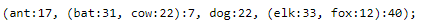
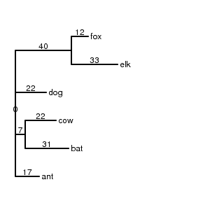
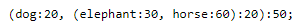
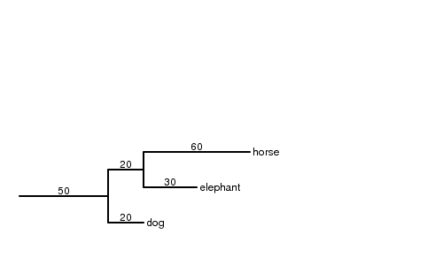

# ASN1-8 - Phylogenetics

## Phylogenetics

The process of evolution leaves traces in the very genes underlying all life. Mutations happen one or more nucleobases at a time, generally randomly. Through the process of selection, organisms with mutations which are beneficial are more likely to reproduce, organisms with neutral mutations with propagate those at an intermediate rate, and organisms with harmful mutations will be less likely to reproduce. As far as we can tell, time only moves forward, so this process of mutation and selection results in an ever-expanding tree of genetic information, as ancestor genomes split and their different progeny contain distinct mutations in different parts of their genomes. Since we understand how this process works, we can create mathematical models of evolution. With data (genome sequences) we can decide which nucleobases or protein amino acid residues correspond to the same original ancestor position, and back-calculate the path that evolution most likely took to transform one ancestor sequence into all of the available sequences in our dataset. This can be done on ancient time scales, with hundreds or thousands of changes across millions of years, where two sequences may be barely recognizable as having the same ancestor by eye. This can also be done on very short time scales, where we can track individual single nucleobase mutations happening one at a time across a scale of days or weeks. 

## Multiple sequence alignment

Since the process of evolution happens at the individual nucleotide level, we need some way to ensure that our data matches up at the individual nucleotide level. To do so, we line up each of the bases in one sequence with the corresponding bases in another sequence. To infer any amount of evolution, we really need at least four sequences. The process of lining up these individual nucleotide or protein letters is called "alignment" and performing alignment with more than two sequences is known as "multiple sequence alignment". We will not cover the theory behind how this is done in this assignment, but I will have a video later discussing this.

Ultimately, there are a variety of programs written to perform this process, aligning multiple sequences and providing output with each sequence lined with with each letter in each sequence matching up with a letter in every other sequence, to the best of the program's ability to predict. Some popular programs to perform this analysis include Clustal, MAFFT, Muscle, and T-COFFEE. Each has its own strengths, although generally all programs will perform similarly on all but the most challenging alignment tasks.

This process, likely almost everything we do, has an input and an output. The input will look very familiar. Generally, the input to a sequence alignment program are biological sequences in FASTA format which we have used multiple times in previous assignments. 

```
>Sequence1
ATCGTAGCGTTAGCGAGTCAGTCGATCGGATCGTAGTCAGG
>Sequence2
ATCGAAGCGCTAGCGCCGTCAGTCGATCGGTTCGTAATCAGG
>Sequence3
AATCGAAGCGCTAGGGCCGTCAGTCCGGTTCGTAATCAGG
```

The output of a multiple sequence alignment program will also be a series of sequences, although these may come in several different formats of varying complexity, including ClustalW, NEXUS, PHYLIP, Stockholm, or FASTA. We will be sticking with the most simple format, FASTA, which we already know about. A FASTA format alignment file will look a lot like any other FASTA file, with one addition. Instead of being only nucleotide or protein letters, an alignment file will contain an extra symbol `-` which represents a "gap" a position where the sequence containing the gap does not have a letter corresponding to that position in all of the other sequences:

```
>Sequence1
-ATCGTAGCGTTAGCGA-GTCAGTCGATCGGATCGTAGTCAGG
>Sequence2
-ATCGAAGCGCTAGCGCCGTCAGTCGATCGGTTCGTAATCAGG
>Sequence3
AATCGAAGCGCTAGGGCCGTCAGTC---CGGTTCGTAATCAGG
```

In these FASTA format sequences, we can see how, despite being different lengths, they correspond to very similar sequences, with some changes and a few positions present in sequence 2 that are missing in either sequence 1 or 3. Each "column" in these FASTA sequences, letters at the same position, correspond to "homologous" residues that presumably evolved from the same position in the ancestor sequence. Positions missing in one sequence represent positions that were added or lost at some point in the evolution of these sequences. In addition to being of great interest to molecular biologists studying a family of sequences, we can use these columns of letters, along with a model of evolution, to determine what process was most likely to have resulted in this exact set of sequences. For practical reasons, few models of evolution account for the process of addition or subtraction of positions, instead purely focusing on substitutions, changes of a position from at A -> T or C -> G. 

**Q1) Look at the position where three bases in a row are missing from sequence 3. Can you tell if those bases were added to sequences 1 and 2 or lost from sequence 3? If so, which do you think happened, and why?**

### Obtaining test data

For this assignment, we will be using a dataset of 12 protein sequences, each corresponding to the GAPDH gene, a "Glyceraldehyde-3-phosphate dehydrogenase" which is present in essentially all organisms and is an integral part of the glycolysis pathway organisms use to breakdown glucose for energy. This file is present on TOD-compute in the `/mnt/storage/data/phylo_data/` folder as the `gapdh.fasta` file. I would like to you make an ASN1-8 folder and copy this file into it to begin:

```bash
mkdir ASN1-8

cd ASN1-8

cp /mnt/storage/data/phylo_data/gapdh.fasta .
```

**Q3) Open this file up using your choice of text file viewer (`less`, `nano`, etc). This FASTA file has sequence names corresponding to the scientific names of the organism each GAPDH sequence is from. What are the common names of these twelve species?**


### Performing an MSA with T-COFFEE

We are going to use a program called T-COFFEE to perform our multiple sequence alignment. In practice, T-COFFEE is a large package that can use a huge variety of methods to perform MSA and more. 

http://www.tcoffee.org/Projects/tcoffee/index.html

T-COFFEE has been pre-installed on TOD-compute for you, so you do not need to install anything. T-COFFEE is also available as a web service which you can use online:

http://tcoffee.crg.cat/

Performing an alignment with T-COFFEE can be complicated, as there are many parameters, but performing an alignment can also be as simple as running:

```bash
t_coffee -seq gapdh.fasta
```

We use the `-seq` flag to tell T-COFFEE to look for seqences in the `gapdh.fasta` file. If you run this in your ASN1-8 folder, you should get quite a bit of output, first, some output describing what T_COFFEE is doing, followed by a large alignment, and finally a summary of the output, that may look something like this:

```
OUTPUT RESULTS
        #### File Type= GUIDE_TREE      Format= newick          Name= gapdh.dnd
        #### File Type= MSA             Format= aln             Name= gapdh.aln
        #### File Type= MSA             Format= html            Name= gapdh.html

# Command Line: t_coffee gapdh.fasta  [PROGRAM:T-COFFEE]
# T-COFFEE Memory Usage: Current= 30.267 Mb, Max= 32.478 Mb
# Results Produced with T-COFFEE Version_13.41.15.6eaf8df (2020-03-31 17:38:31 - Revision 8874b4a - Build 480)
# T-COFFEE is available from http://www.tcoffee.org
# Register on: https://groups.google.com/group/tcoffee/
```

We have three output files, a "guide tree" in `gapdh.dnd`, and MSA (alignment) files in `gapdh.aln` and `gapdh.html`. The HTML file is a formated web page that I encourage you to download and open in your browser. The other appears to be an `.aln` file. This is the computer-readable alignment output we want.

**Q3) Open this file up using your choice of text file viewer (`less`, `nano`, etc). Is this a FASTA format file? If not, can you tell what file format this is?**

It turns out T-COFFEE doesn't default to creating the FASTA alignmetn file we want. Fortunately, T-COFFEE is flexible and has an option to let us specify what output we would like. You can find this feature and many more in the T-COFFEE documentation:

http://www.tcoffee.org/Projects/tcoffee/documentation/index.html#document-tcoffee_quickstart

```bash
t_coffee -seq gapdh.fasta -output=fasta_aln
```

Again, you will see essentially the same output, except now you get these results:

```
OUTPUT RESULTS
        #### File Type= GUIDE_TREE      Format= newick          Name= gapdh.dnd
        #### File Type= MSA             Format= fasta_aln       Name= gapdh.fasta_aln
```

Take a look at the `gapdh.fasta_aln` file and ensure this looks like you expect. This aligned file will be our input to the following steps.

### Performing an MSA with MAFFT

You may have noticed that even with only twelve short sequences, T-COFFEE took a few seconds to compute the MSA. These types of algorithms do not scale well, a program that takes 5 seconds for twelve sequence may take minutes for 100 sequences, hours for thousands, and many days for ten thousand. In some situations, we would like to perform analyses on much larger sets of sequences, and (basic) T-COFFEE is not suitable. There are a huge variety of programs which can perform multiple sequence alignments with a wide range of speeds and accuracy. One flexible, high-performing tool is called MAFFT. 

https://mafft.cbrc.jp/alignment/software/

Again, MAFFT has been pre-installed for you. MAFFT is capable of aligning thousands of sequences very quickly with reasonable accuracy. We will use a second, much larger dataset. In the same `/mnt/storage/data/phylo_data/` folder is a file `antar.fasta`. This has thousands of sequences which are similar in size but more distantly related, across essentially all bacteria.

**Q4) Copy the file to your ASN1-8 folder. How many sequences are in this FASTA file? (You may have to revisit an older assignment or DataCamp, use `grep`, `wc`, etc)**

MAFFT is even simpler to run than T-COFFEE. You can simply run `mafft` with the FASTA filename as the only argument. Unlikely T-COFFEE, which outputs the alignment and other data directly to files, MAFFT outputs the alignment to standard output, so we need to redirect the output:

```bash
mafft antar.fasta > antar.aln
```

You may notice that this takes only a few seconds longer than T-COFFEE, but is aligning thousands more sequences rather than just twelve. This is at the expensive of some accuracy. We will also use this file in the next step.

**Q5) Take a look at the `antar.aln` file with `less` or `nano`. What major differences do you notice between this file and the GAPDH alignment?**

## Trimming

Since our models of evolution only account substitutions from one letter to another, columns in an alignment with a large proportion of gaps can interfere with or slow down calculations when building a phylogenetic model of the evolution of our sequences. A common step in the process of a phylogenetic analysis is to "trim" the alignment, removing certain uninformative positions from all sequences, or removing entire sequences which turn out to align poorly with the rest and may not actually be in the same evolutionary family. The first process is usually done by choosing a threshold, the maximum percentage of gaps a column can have and be kept in the trimmed dataset. The second can be done in different ways, either by manually inspecting an alignment to identify sequences which do not generally follow the pattern the rest do, or by calculating a metric for how well each sequence fits, choosing a threshold, and removing sequences below that threshold.

Generally, we would like to transform our data while keeping it in the same format, or otherwise ensuring it is in a suitable format for the next step. Most tree-building programs can take FASTA alignments as input, so we will stick with FASTA alignments.

### Trimming gaps with T-COFFEE

You may have noticed there are few `-` gap characters in the GAPDH alignment, so we probably don't need to remove any columns, but it does make it easy to see what is happening! T-COFFEE can do more than just align sequences, it can also manipulate sequences and alignments with its `-seq_reformat` tool. This tool is very powerful and can do a variety of manipulations:

http://www.tcoffee.org/Projects/tcoffee/documentation/index.html#preparing-your-data

For our purposes, we will use the +rm_gap action to remove all columns with more than 50% gap characters:

```bash
t_coffee -other_pg seq_reformat -in gapdh.fasta_aln -action +rm_gap 50
```

When you run this, you may notice that the `-seq_reformat` option behaves a little differently than the basic alignment. Instead of giving a lot of diagnostic output and a summary, this command behaves more like MAFFT and outputs the FASTA alignment directly to the screen. 

Run the previous command but redirect the output to a `gapdh.trim.fasta_aln` file.

**Q6) Compare the `gapdh.fasta_aln` and `gapdh.trim.fasta_aln` files. Roughly (or exactly if you like) how many columns were trimmed out?**

### Removing outlier sequence with T-COFFEE

In the GAPDH dataset, it is clear that all sequences contain very similar sequence and there are very few gaps, indiciating a good alignment. The ANTAR dataset on the other hand, looks much messier. T-COFFEE can come to the rescue. Among the many options that the `-seq_reformat` tools has, it can remove outlier sequences! We can do this with the following command:

```
t_coffee -other_pg seq_reformat -in antar.aln -action +trim _aln_O25 > antar.nooutliers.aln
```

The `+trim` action will trim out entire seequences. The argument has some special syntax, described in the documentation linked at the beginning of last section. In short, the `_aln` part tells it to use the alignment it is given, the `_O` tells it to trim "O"utliers, and the number is the accuracy threshold to remove sequences below. This command will calcualte the alignment accuracy between all pairs of sequences, and remove any sequences with below 25% average accuracy with all other sequences. As before, this tool outputs the alignment to standard output, so we use BASH to redirect the output. This will also output a lot of diagnostics to the screen, telling you which outputs were removed.

**Q7) Compare the `antar.aln` and `antar.nooutliers.aln` files. How many outliers were removed?**

Since the ANTAR alignment has many more gaps, it is extra important to remove heavily-gapped columns:

```bash
t_coffee -other_pg seq_reformat -in antar.nooutliers.aln -action +rm_gap 50 > antar.trim.aln
```

## Tree building

As we mentioned before, the (simplified) process of evolution can be thought of as a branching tree, where a single ancestor sequence gains mutations, reproduces, and different lineages contain all the distinct mutations of their predecessors. Of course, there is nothing preventing a position that has changed once from changing again, or even reverting to its ancestor's sequence. Because of these issues and other complicating factors (such as missing or insufficient data), determining the exact process that generated a set of sequences is usually not possible. The best we can do is determine a model of evolution, the paths that evolution took to transform a hypothetical ancestor sequence to our sequences, that fits "the best". What "the best" means can be defined in a few ways. It could mean the simplest route, the "most parsimonious" route, which took the fewest mutations to generate our sequences. On the other hand, not all mutations are equally likely, so taking into account a model of evolution which knows the probability of each mutation, we can calculate the likelihood that a particular evolutionary path generated our sequences, the "maximum likelihood" model. Each of these methods has its benefits, although for our purposes we will likely stick with "maximum likelihood" methods.

This process of determining an evolutionary model can be called different things, like phylogenetic tree reconstruction or tree-building. Like our other steps, this process has an input and an output. At the simplest level, all phylogenetic tree reconstruction programs take a multiple sequence alignment as input, and can generally handle FASTA alignments. The program will then output a representation of a tree. These generally come in one of two formats, Newick or NEXUS format. NEXUS is a more complicated format which is almost a miniature scripting language and can incorporate sequence alignments and analysis steps. Newick format is simpler and represents single trees as a (sometimes very long) line of nested parentheses which can be parsed into a tree. 



Although nothing more than parentheses and commas is truly required for Newick format, Newick trees often have additional data. Names of individual nodes or leaves in the tree can be provided before the colon, and the distance that this node is from its parent can be represented as a number after the colon. Additionally, some trees may contain a third number, representing the "confidence" or "bootstrap" score a particular split has, a kind of error bar illustrating the confidence that that particular section of the tree is correct.

These computer-readable representations are not at all convenient for our brains to parse, but computers are capable of generating images with a more human-readable interpretation of the data:



Each non-leaf node in a tree represents the relationship between an ancestor sequence and two or more child sequnces which diverged. In reality there is a single true ancestor sequence which should be at the "root" of the tree. Unforunately, without more information, tree reconstruction algorithms don't know which direction any particular mutation went. An A -> G mutation is just as possible as the reverse G -> A mutation. For this reason, the programs generally output an "unrooted tree", where each internal node has three or more connections, and it is unclear where the true ancestor lies. If we have reason to believe a certain group was the most distant ancestor, we can create a "rooted" tree:



Instead of having three or more children, the "root node" will only have two and may have a distance defined for it. 



We can use these trees to interpret how this evolutionary reconstruction informs our understanding of how these sequences evolved and the relationships between them.

### Tree reconstruction with FastTree

There are many tools available to reconstruct phylogenetic trees. Similarly to MSA programs, these will largely have similar results on less-challenging datasets. Tree reconstruction, however, is perhaps an even more difficult problem than multiple sequence alignment, and for challenging datasets careful choice of program, evolutionary model, and parameters is necesssary for good results. Expertise in these considerations is not something we will try to gain in this assignment. We will be using a simple, efficient, and reasonably accurate tree reconstruction program called FastTree. FastTree uses FASTA alignments as input and Newick trees as output with incredibly simple syntax, so we can work quickly:

```bash
fasttree gapdh.trim.fasta_aln > gapdh.nwk
```

FastTree works on the standard Unix syntax, and sends the output Newick tree file to standard output, so we redirect the output to our file. Take a look at this `gapdh.nwk` file however you wish. You should notice it has both the species names as well as some numbers. Some numbers are found next to the name, like `Homo_sapiens:0.026888492` and represent the branch length seperating that node from its parent. This number is a representation of "how much evolution" happened to generate this sequence from its immediate ancestor. You may see other numbers, found after some parentheses, as in `(Arabidopsis_thaliana:0.087364029,Oryza_sativa:0.062867179)0.999`. These are the support values, in a range from 0 to 1 (in this case 0.999), with 1 representing absolute confidence, with numbers above 0.5 being generally reliable.

We can generate a similar tree for the ANTAR alignment (This may take two or three minutes to run):

```bash
fasttree antar.trim.aln > antar.nwk
```

You should download both the `gapdb.nwk` and `antar.nwk` files to your computer using WinSCP or Fetch.

## Tree visualization

If you get here and see this message, you should refresh this page. If you still see it, yell at me on Discord or email so I can update the page.